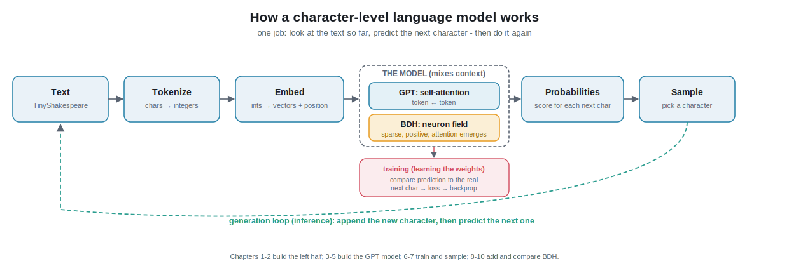

# Chapter 0 - The Overview (start here)

This chapter gives you the **whole mental model** in one sitting. Every later
chapter zooms into one box of the picture below. No code yet - just the map.

> If a word looks like jargon, it is defined in [`glossary.md`](glossary.md).

## 1. What is a "language model", really?

A language model does exactly **one** tiny thing:

> Given some text so far, predict the **next** piece of text.

That's it. "To be or not to b" → it predicts **"e"**. Do that over and over,
feeding each prediction back in, and it writes whole passages. Everything else -
attention, embeddings, training - exists only to make that one next-piece
prediction good.

Because our models work one **character** at a time (character-level), "the next
piece" is literally "the next letter". So our whole goal is: **look at the last
few hundred characters and guess the next character.**

## 2. The pipeline (the diagram, in words)

Text can't go into a neural network - networks only do math on numbers. So we run
this assembly line:

1. **Text → tokens (numbers).** We list every unique character in Shakespeare
   (~65 of them: letters, space, punctuation). Each gets an integer id. `'h' → 46`.
   This is **tokenization** (Chapter 1).
2. **Tokens → vectors (meaning).** Each integer is looked up in a table to become
   a list of numbers (a **vector**) that the model can shape into "meaning". We
   also add a second vector saying **where** the token sits in the sequence
   (position). This is **embedding** (Chapter 2).
3. **The model thinks.** A stack of layers mixes information *between* positions so
   each spot in the text can "look back" at earlier spots and build context. This
   is where the two architectures differ:
   - **Transformer (GPT):** uses **self-attention** - every token directly
     compares itself to every previous token (Chapters 3-5).
   - **BDH:** uses **neuron-level dynamics** - a large field of neurons with
     sparse, positive activity and attention that emerges from local interactions
     (Chapter 8).
4. **Model → next-character probabilities.** The final layer outputs a score for
   each of the ~65 possible next characters, turned into probabilities that sum
   to 1. `'e': 0.71, 'a': 0.05, ...`.
5. **Sample → a character.** We pick a character using those probabilities, append
   it to the text, and go back to step 1. This loop is **generation** (Chapter 7).

## 3. Two modes: training vs inference

The same model is used in two modes - keep them separate in your head:

- **Training (learning).** We show the model real Shakespeare and ask it to
  predict each next character. When it's wrong, we measure *how* wrong (the
  **loss**) and nudge every number in the model a tiny bit to be less wrong next
  time. Repeat millions of times. The "nudging" is **gradient descent** via
  **backpropagation** (Chapter 6). This is the expensive part.
- **Inference (using it).** Weights are now frozen; we just run the pipeline
  forward to generate text (Chapter 7). Cheap.

> **What kind of training is this?** *Self-supervised* learning: we never hand-label
> anything. The "correct answer" for each position is simply the character that
> actually comes next in the text - the data labels itself. That is exactly how
> GPT-style models are pre-trained.

## 4. What we will actually build

- A shared **scaffold**: the data loader, the character tokenizer, the training
  loop, and the sampler - written once, used by both models.
- **`model_gpt.py`**: the Transformer, from a single attention head up to a full
  multi-layer GPT.
- **`model_bdh.py`**: the Dragon Hatchling, so we can train it on the same data
  and compare.
- A **comparison + interpretability report**: which learns faster, which is
  cheaper, and BDH's special claims (sparse activations, an emergent brain-like
  graph, "monosemantic synapses" - Chapter 9).

## 5. GPT vs BDH in one line

|  | Transformer (GPT) | BDH (Dragon Hatchling) |
|--|-------------------|------------------------|
| Core mixing | self-attention (token ↔ token) | neuron-field dynamics; attention *emerges* |
| Activations | dense, can be +/- | **sparse and positive** (~5% active) |
| Memory of context | KV-cache (a growing buffer) | stored in **synapses** (edge weights) |
| Interpretability | hard (superposition) | designed-in (monosemantic synapses) |
| Our purpose | the baseline you must understand first | the cool alternative we test against it |

## 6. Where the ideas come from (sources)

- **Transformers:** Vaswani et al., *Attention Is All You Need* (2017).
- **GPT-2:** Radford et al., *Language Models are Unsupervised Multitask Learners*
  (2019).
- **The build style:** Andrej Karpathy's `nanoGPT` and his "Let's build GPT" /
  "Let's reproduce GPT-2" material - the clearest from-scratch teaching anywhere.
- **BDH:** Kosowski et al., *The Dragon Hatchling* (2025), arXiv:2509.26507; code
  at github.com/pathwaycom/bdh. The PDF is in [`../paper/`](../paper/).

Explanations in these docs are written in our own words and grounded in the above.

---

**Next:** [Chapter 1 - Data & Tokenization](01-data-and-tokenization.md): we
download TinyShakespeare and turn it into a stream of integers, and you'll see
your first real code.
