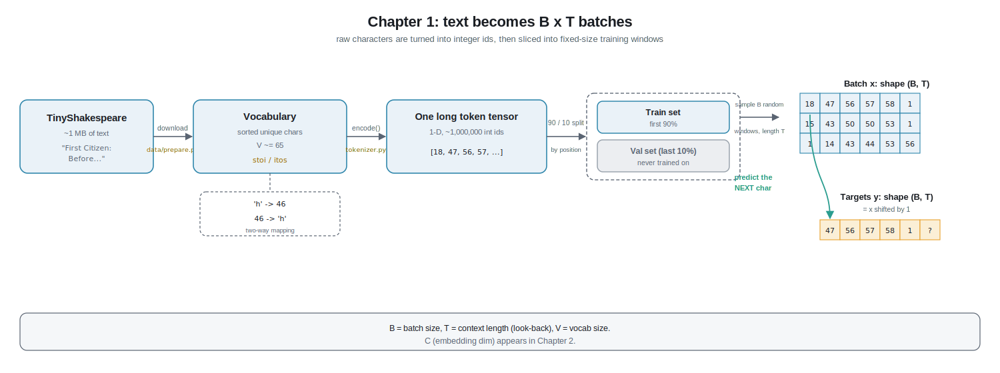

# Chapter 1 - Data and Tokenization

> Files this chapter is about: [`data/prepare.py`](../data/prepare.py) (download, build the vocabulary, encode, split) and [`nanobdh/tokenizer.py`](../nanobdh/tokenizer.py) (the `CharTokenizer` that turns text into numbers and back).
>
> If a word looks like jargon, it is also in [`glossary.md`](glossary.md).

## 1. The plain-English version

Imagine you want to teach a friend who only speaks in numbers. You cannot hand them a book, because they cannot read letters. So you agree on a secret code first: `a = 1`, `b = 2`, `c = 3`, and so on. Now you can read the book out loud as a stream of numbers, and your friend can "read along" and even guess the next number. When they answer with a number, you translate it back into a letter so you can understand them.

That is the entire job of this chapter. A neural network is exactly that number-only friend. It cannot see the letter `h`. It can only do math on numbers. So before any learning can happen, we have to:

1. get the text (TinyShakespeare),
2. agree on the secret code (which letter maps to which number),
3. translate the whole book into numbers,
4. set some pages aside to test the friend honestly later,
5. hand the friend small, equal-length snippets to practice on.

No math, no model yet. Just turning a book into a long list of numbers, carefully.

## 2. From zero, every term defined

### The dataset: TinyShakespeare

**TinyShakespeare** is a single plain-text file, about 1 megabyte, containing a big chunk of Shakespeare's plays (lines like `First Citizen: Before we proceed any further, hear me speak.`). It is popular for learning because it is small enough to train on a laptop in minutes, but rich enough that a model has to learn real structure: spelling, names, line breaks, who speaks when.

A **dataset** just means "the collection of examples we learn from". Here the dataset is one long string of characters.

`data/prepare.py` downloads this file once (from Karpathy's public copy) and saves it locally so we never re-download it.

### Why text must become integers

A neural network is, under the hood, a giant pile of multiplications and additions on numbers. It has no concept of "the letter e". So the very first thing we must do is replace every character with a number. That step is called **tokenization**.

- A **token** is one "piece" of the text that we treat as a single unit. In this project a token is exactly **one character** (`h`, ` ` the space, `,`, a newline, and so on). That is what "character-level" means. Bigger models often use subword pieces (BPE), but we deliberately keep it dead simple: one character = one token.
- An **integer** is just a whole number (`0, 1, 2, ...`). Each distinct character gets its own integer **id**.

So `'h'` might become `46`. The model never sees `h`; it sees `46`.

### Building the character vocabulary

The **vocabulary** (often shortened to **vocab**) is the complete list of every unique character that appears in the file, sorted. For TinyShakespeare this is about **65** characters: the lowercase letters, the uppercase letters, the space, the newline, and punctuation like `,`, `.`, `:`, `!`, `?`, and the apostrophe.

We build it in one honest pass over the text: collect every character, keep only the unique ones, sort them so the order is fixed and reproducible. **Vocabulary size**, written **V**, is just how many entries are in that list (here V is about 65).

From the sorted vocabulary we build two lookup tables. This lives in `nanobdh/tokenizer.py`:

- **`stoi`** ("string to integer"): given a character, return its id. `stoi['h'] = 46`.
- **`itos`** ("integer to string"): the reverse. `itos[46] = 'h'`.

They are perfect mirrors of each other, which is what lets us go text to numbers and back with no loss.

### Encode and decode

- **`encode(text)`** walks through a string and replaces each character with its id, producing a list of integers. `"hi"` becomes `[46, 47]`.
- **`decode(ids)`** does the reverse: it takes a list of integers and glues the characters back together into a string.

A good sanity check, and one we actually run: `decode(encode("hello")) == "hello"`. If that round-trip is not identical, the tokenizer is broken.

### One long token tensor

Once we can encode, we encode the **entire** file in one shot. The result is one very long sequence of integers, roughly a million of them for TinyShakespeare.

We store this in a **tensor**. A tensor is just the machine-learning word for a grid of numbers (a 1-dimensional tensor is a plain list, a 2-dimensional tensor is a table, and so on). We use PyTorch tensors because they can live on the GPU and be processed fast. So the whole works of Shakespeare become a single 1-dimensional tensor of integer ids. That is the raw material for everything else.

### Train and validation split

If you let a student memorize the exact exam answers, a perfect score proves nothing. Machine learning has the same trap. So we cut the token tensor into two parts:

- the **training set** (we use the first 90 percent): the model is allowed to learn from this,
- the **validation set** (the last 10 percent): the model **never** learns from this; we only use it to *check* how well the model does on text it has not studied.

If the model does great on the training set but poorly on the validation set, it has just **memorized** instead of **learned**. That gap is how we catch **overfitting** (Chapter 6 goes deeper). Because it is one continuous book, we split by position (first 90 percent vs last 10 percent) rather than shuffling, so each half stays as readable, continuous text.

### Batches, and why context length matters

We cannot feed a million characters to the model at once; it would not fit in memory and it would not help learning. Instead we hand it many small, fixed-length snippets at a time. Two numbers control this:

- **T**, the **context length** (also called **block size**): how many characters are in one snippet. If T is 8, one snippet is 8 characters long. T is the model's "attention span": the maximum amount of past text it can look at when predicting the next character. Bigger T means it can use longer-range clues (like matching a character name mentioned lines ago), but costs more memory and compute.
- **B**, the **batch size**: how many snippets we process side by side in one step. Doing 32 snippets together is far faster on a GPU than doing them one at a time, and it makes each learning step steadier.

So one chunk of data we feed the model is a grid of shape **B by T**: B rows, each row a snippet of T character-ids.

The clever bit: for each snippet we also need the "right answers". The target for every position is simply **the next character**. So if the input snippet is characters at positions `i .. i+T-1`, the target snippet is the characters at positions `i+1 .. i+T`, the same window shifted one position later in the text. Within a single T-length snippet, that gives us T separate prediction problems at once (predict char 2 from char 1, char 3 from chars 1 to 2, and so on). No human labeling needed, which is why this is called **self-supervised** learning: the text is its own answer key.

That is the whole pipeline of Chapter 1: **file to characters to ids to one long tensor to a train/val split to B by T batches with shifted targets.**

## 3. Deeper dive

You know the basics now. Here is what is actually going on, with shapes.

### The notation, pinned down

Throughout nano-bdh we use one fixed vocabulary of symbols:

- **B** = batch size (snippets processed in parallel)
- **T** = context length / block size (tokens per snippet)
- **C** = embedding dimension (the size of each token's meaning-vector; introduced in Chapter 2, not this one)
- **V** = vocabulary size (about 65 here)
- also `n_head`, `n_layer` for later chapters.

Chapter 1 produces integers in the range `[0, V)` and arranges them into `(B, T)` blocks. C does not appear yet; it enters the moment we embed these ids in Chapter 2.

### Why character-level, not BPE

Real GPT-2 uses **BPE** (byte-pair encoding), which merges common byte sequences into subword tokens, giving a vocab of ~50,000. We deliberately do **not**. Reasons:

1. **Transparency for teaching.** With V about 65 you can print the entire vocabulary and read it. There is no opaque merge table to trust.
2. **Tiny embedding and output layers.** The input embedding table and the final language-model head both scale with V. V about 65 keeps the model small enough to train on Apple MPS in minutes.
3. **It isolates the concept.** The point of nano-bdh is the *architecture* (Transformer vs BDH), not tokenizer engineering. Character-level removes a whole confounding variable.

The cost is that sequences are longer in characters than they would be in BPE tokens, so the model must learn spelling from scratch and needs a decent T to capture word-level patterns. That is a fair trade for clarity, and it is exactly the setting in Karpathy's "Let's build GPT".

### Deterministic vocabulary and why order matters

The vocabulary is `sorted(set(text))`. Sorting is not cosmetic: it makes the mapping **reproducible**. If two runs built the vocab in different orders, id `46` would mean different characters, and a checkpoint trained in one run would be gibberish when loaded in another. Fixing the order fixes the contract between the data, the saved weights, and the tokenizer. `data/prepare.py` therefore also saves the vocab (the char list) alongside the token tensors so decoding is always consistent.

### The exact batch construction

Given the training tensor `data` (1-D, length `N`), a batch is drawn like this:

1. Pick B random start positions `ix`, each in `[0, N - T - 1]` so a full T-window plus its shifted target fit.
2. `x` = stack of `data[i : i+T]` for each `i` in `ix`  ->  shape `(B, T)`.
3. `y` = stack of `data[i+1 : i+1+T]` for each `i`  ->  shape `(B, T)`.

So `y` holds, for each position, the token one step later in the text: `y[:, t] = x[:, t+1]` within the overlap, and `y`'s last column is the next character just past the input window. Position `t` in a row asks: "given tokens `0..t`, what is token `t+1`?" and the answer sits at `y[:, t]`. One `(B, T)` input therefore contains `B * T` supervised next-character predictions, which is why training is data-efficient even on a 1 MB file.

Both `x` and `y` are moved to the device (`mps` on Mac, else `cpu`) right after sampling, so the compute happens on the GPU. This sampling logic will live in the shared `get_batch` helper used by `nanobdh/train.py`.

### Why T (context length) is the interesting knob

T sets a hard ceiling on how far back the model can see. At character level:

- If T is too small (say 8), the model literally cannot condition on anything older than 8 characters, so it can barely reach across a single word. It will produce locally-plausible letter soup.
- Increasing T lets it capture words, then phrases, then line structure and speaker names.
- But cost grows with T. For the Transformer specifically, self-attention compares every position to every other position, so compute and memory scale with T squared (Chapters 3 to 5). That quadratic cost is the headline reason long context is expensive, and it is precisely one of the things **BDH** (Chapter 8) is designed to sidestep with linear-in-T dynamics. So the value of T you pick here quietly frames the whole GPT-vs-BDH comparison later.

### Sampling with replacement, and the epoch question

We draw random start positions every step **with replacement**, rather than marching through the file in fixed order. For a dataset this small that is standard practice: it decorrelates successive batches and we simply train for a fixed number of iterations rather than counting formal passes over the data (an **epoch**). It also means overlapping windows are fine and even helpful.

### Where the split boundary sits

We split by index: `train = data[:n]`, `val = data[n:]` with `n = int(0.9 * len(data))`. Because we sample windows strictly inside each split, a training window never peeks across into validation text, so the validation loss stays an honest estimate of performance on unseen Shakespeare. This is the measurement we will watch in Chapter 6 to detect overfitting.

## 4. New terms recap

- **TinyShakespeare**: the ~1 MB plain-text Shakespeare file we train on.
- **Dataset**: the collection of examples we learn from (here, one long string).
- **Token**: one unit of text fed to the model; for us, exactly one character.
- **Character-level**: tokenizing per character rather than per word or subword.
- **Tokenization**: converting text into a sequence of integer ids.
- **Vocabulary (vocab)**: the sorted list of all unique characters; its size is **V** (~65).
- **id**: the integer assigned to a specific character.
- **stoi / itos**: the two lookup tables (string-to-integer and integer-to-string) inside `CharTokenizer`.
- **encode / decode**: turn text into ids, and ids back into text.
- **Tensor**: a grid of numbers (PyTorch), able to live on the GPU.
- **Training set / validation set**: the 90 percent the model learns from, and the held-out 10 percent used only to test it honestly.
- **Overfitting**: memorizing the training data instead of learning general patterns; caught by a train-vs-val gap.
- **Batch size (B)**: how many snippets are processed in parallel.
- **Context length / block size (T)**: how many tokens are in one snippet; the model's maximum look-back.
- **Self-supervised learning**: the target is just the next character in the text, so no manual labels are needed.
- **Epoch**: one full pass over the dataset (we train by iteration count instead).
- **BPE**: byte-pair encoding, the subword tokenizer real GPT-2 uses, which we deliberately avoid.