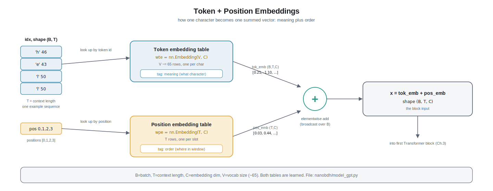

# Chapter 2 - Embeddings

> Prereqs: [Chapter 0 - Overview](00-overview.md) and [Chapter 1 - Data & Tokenization](01-data-and-tokenization.md). By now you know that text becomes a stream of integer token ids (for us, one integer per character, about 65 different ones). This chapter is step 2 of the pipeline: **tokens to vectors (meaning)**.

## 1. The everyday intuition

Imagine you run a giant library and every book has a numbered locker. Book number 46 lives in locker 46. The number itself tells you nothing about the book. It is just an address. To actually *know* the book you have to open the locker and read what is inside.

An **embedding** is exactly that: a locker system for tokens. The token id (say `46` for the letter `h`) is just an address. Inside its locker sits a little list of numbers that describes what that character *means* to the model. The model does not read letters; it reads those lists of numbers. And here is the twist that makes it powerful: the model gets to **rewrite what is inside each locker** during training, slowly filling them with useful descriptions.

There is a second thing we need. If I hand you the word "hats" as a bag of loose letters `{a, h, s, t}`, you cannot tell it apart from "shat" or "tash". The letters are the same; only the **order** differs. So besides "what character is this", the model also needs "where in the line does this character sit". That second piece is the **positional embedding**. We build both little number lists and simply add them together.

## 2. From zero, defining every term

Let me define the words as they appear.

**Vector.** An ordered list of numbers, like `[0.21, -1.10, 0.07, 0.88]`. That is all. A vector of length 4 is just 4 numbers in a fixed order. In this project we call the length of these vectors `C` (the embedding dimension). Our default value is `C = 128`, so each character is described by 128 numbers.

**Meaning vector (embedding).** The vector we store for a token. Nothing about it is "meaningful" at the start; the numbers begin random. Training gradually shapes them so that characters used in similar ways end up with similar vectors. This is the key idea: **meaning is a location in number-space**, and things that behave alike drift close together.

**Token embedding table.** A big lookup table with one row per possible token. We have about 65 possible characters, so the table has 65 rows. Each row is one meaning vector of length `C`. To "embed" the token id `46`, you do not do any math; you just grab **row 46** of the table. That is why it is called a lookup. In code this table is a `torch.nn.Embedding` layer. Because every row is an adjustable set of numbers (weights), the table is *learned*: backpropagation (Chapter 6) nudges the rows over time.

Concretely, in `nanobdh/model_gpt.py` this table is created as `nn.Embedding(vocab_size, n_embd)`, which in our notation is `nn.Embedding(V, C)`. `V` is the vocabulary size (about 65), `C` is the embedding dimension.

**Why not just feed the integer 46 directly?** Two reasons. First, raw integers imply a fake ordering: `46` is not "bigger" or "more" than `45`; the characters `h` and `g` are not numerically related, but the number line pretends they are. Second, a single number cannot capture the many independent things a character can be (a vowel, a common letter, a line-starter, part of "the"). A vector of `C` numbers gives the model `C` independent dials to describe each character however is useful. One integer gives it one dial. That is the whole reason we expand each id into a vector.

**Position.** Where a token sits in the current chunk of text. If our context length is `T` characters, the positions are `0, 1, 2, ..., T-1`. Position 0 is the first character in the window, position 1 the second, and so on.

**Positional embedding.** A second lookup table, this one with one row per position. It has `T` rows (one per slot in the window), each again a vector of length `C`. Row 0 is "the vector that means slot 0", row 1 is "the vector that means slot 1", and so on. These rows are also learned. In `nanobdh/model_gpt.py` this is `nn.Embedding(block_size, n_embd)`, in our notation `nn.Embedding(T, C)`, where `T` is the block/context length (for example 128).

**Why does the model need this at all?** Peek ahead to Chapter 3. The core mixing operation, **self-attention**, compares every token to every other token as an unordered set. On its own it literally cannot tell whether `h` came before or after `e`. It is order-blind. Shakespeare is not: "the" and "eht" are very different. So we stamp each token with a position vector before attention runs. Now the character `h` at slot 3 carries a different total vector than the same `h` at slot 40, and attention can use that to reason about order.

**Adding them.** For each character in the window we now have two vectors of the same length `C`: its meaning vector (from the token table) and its position vector (from the position table). We combine them by plain **elementwise addition**: add the first numbers, add the second numbers, and so on. The result is one vector of length `C` per character that encodes both "what character" and "where it is". That single summed vector is what actually flows into the rest of the model.

You might expect us to glue them side by side instead (making a longer vector). Adding is the choice GPT and nanoGPT make: it keeps the width fixed at `C` so every later layer has a predictable size, and in a space of over a hundred dimensions there is plenty of room for the network to keep the "what" and the "where" parts separable. It works well in practice, which is the honest reason it is used.

## 3. Deeper dive

### The shapes, end to end

Recall the notation: `B` = batch size (how many independent text chunks we process at once), `T` = block/context length (characters per chunk), `C` = embedding dim, `V` = vocab size (about 65 for char-level TinyShakespeare).

The data loader hands the model a batch of token ids as an integer tensor of shape `(B, T)`. Call it `idx`. In `nanobdh/model_gpt.py` the forward pass does roughly this:

- `tok_emb = self.transformer.wte(idx)` where `wte` is `nn.Embedding(V, C)`. Indexing the table with a `(B, T)` block of ids returns `(B, T, C)`. Every one of the `B*T` ids has been replaced by its `C`-length row.
- `pos = torch.arange(T)` gives `[0, 1, ..., T-1]`, shape `(T,)`. Then `pos_emb = self.transformer.wpe(pos)` with `wpe = nn.Embedding(T, C)` returns `(T, C)`, one position vector per slot.
- `x = tok_emb + pos_emb`. Shapes `(B, T, C) + (T, C)`. PyTorch **broadcasting** stretches the position tensor across the batch axis automatically, so the same set of `T` position vectors is added to every sequence in the batch. Result: `x` of shape `(B, T, C)`.

That `(B, T, C)` tensor is the input to the first Transformer block. Nothing downstream needs to know that `x` came from two tables added together; it just sees `C` numbers per position.

### Where the parameters are

The token table holds `V * C` numbers (about `65 * 128`, roughly 8k) and the position table holds `T * C` numbers (about `128 * 128`, roughly 16k). Tiny compared with the attention and MLP weights, but they are genuine learned parameters trained by the same gradient descent as everything else. At initialization both tables are small random numbers, so at step 0 the "meaning" and "position" vectors are meaningless noise; the loss signal is what carves structure into them.

A neat consequence of char-level modeling: with only about 65 rows in the token table, after training you can inspect them directly. Vowels tend to cluster, whitespace and newline sit apart, and capital letters group together, because characters that are interchangeable in context get pulled toward similar vectors. This is far easier to eyeball than a 50,000-row BPE table.

### Learned positions vs the original sinusoids

The very first Transformer, Vaswani et al. 2017 ("Attention Is All You Need"), did not learn positions. It used a fixed formula of sines and cosines of different frequencies to generate each position vector. The appeal was that a fixed formula can, in principle, describe positions longer than any seen in training.

GPT-2 (Radford et al. 2019) and Karpathy's nanoGPT instead use a **learned** position table, which is what we do in `nanobdh/model_gpt.py`. The trade is simple. Learned positions are dead easy to implement (it is just a second `nn.Embedding`) and let the model discover whatever positional structure helps. The cost is a hard cap: the table has exactly `T` rows, so the model can never be fed a context longer than `T`. In `nanobdh/model_gpt.py` this is guarded by an assertion that the incoming sequence length does not exceed `block_size`. For our fixed-window Shakespeare trainer that limit is fine.

### How this connects to BDH

BDH (`nanobdh/model_bdh.py`, Chapter 8) still needs to turn token ids into vectors, so it also has a token embedding of shape roughly `(V, C)`. Where it differs is how it handles order: BDH does not use a separate additive learned position table at all. Instead it injects position with **RoPE (rotary position embeddings)** applied to the queries and keys inside its (linear) attention, together with a strictly-causal mask so each token attends only to strictly-earlier tokens. We flag the contrast here and unpack it fully in Chapter 8. The takeaway for now: "id to meaning vector" is universal; "how order gets injected" is an architecture choice - a learned additive `(T, C)` table in GPT-2/nanoGPT, rotary embeddings inside attention in BDH.

### Sanity checks worth running

- Feed a single sequence and confirm `tok_emb` has shape `(1, T, C)` and `pos_emb` has shape `(T, C)`, and that `x` is `(1, T, C)`.
- Set `T` larger than `block_size` and confirm the model raises the assertion rather than silently indexing out of range.
- After a little training, print the token table row for `' '` (space) and for a common letter; the numbers should differ, whereas at init they are both random noise.

## New terms

- **Vector** - an ordered list of numbers of fixed length; here that length is `C`.
- **Embedding dimension (`C`)** - how many numbers describe each token; the width of every meaning vector.
- **Token embedding table** - a lookup table with one learned vector per token id (`V` rows, `C` columns); `nn.Embedding(V, C)` in `nanobdh/model_gpt.py`.
- **Meaning vector** - the `C`-length vector a token id maps to; similar-behaving tokens drift to similar vectors during training.
- **Lookup** - fetching a row by index instead of computing it; embedding is a row lookup, not multiplication.
- **Position** - which slot `0..T-1` a token occupies in the current window.
- **Positional embedding** - a second learned table with one vector per position (`T` rows, `C` columns); tells the model order, which attention alone cannot see.
- **Elementwise addition** - combining two same-length vectors by adding matching entries; how we merge token and position vectors.
- **Broadcasting** - PyTorch automatically stretching a smaller-shaped tensor (the `(T, C)` positions) across a larger one (the `(B, T, C)` batch) during addition.
- **Learned vs sinusoidal positions** - GPT-2/nanoGPT learn the position table (our choice, capped at `T`); Vaswani 2017 used a fixed sine/cosine formula.

---

**Next:** [Chapter 3 - Self-Attention](03-self-attention.md): now that every position carries a "what plus where" vector, we let positions look back at each other and mix information.