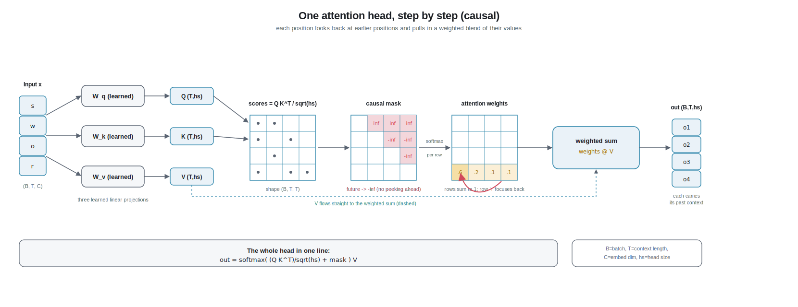

# Chapter 3 - Self-Attention

The model code for everything below lives in `nanobdh/model_gpt.py`. This chapter explains the single most important idea in the Transformer, the idea the 2017 paper was literally named after: *attention*. We build it here for **one** attention head, step by step. Chapters 4 and 5 stack many heads and many layers on top of exactly this.

> New words are defined the moment they appear, and collected again at the end. Anything from earlier chapters is in [`glossary.md`](glossary.md).

## 1. The everyday version (no jargon)

Imagine you are reading this sentence out loud and you hit the word **"it"**:

> "The soldier drew his sword because **it** was sharp."

To know what "it" means, your eyes flick *back* over the words you already read. You skip "the", "because", "his", and you land on **"sword"**. You did not treat every earlier word equally. You searched for the one that answers the question "what does *it* point to?", found "sword", and pulled its meaning forward.

That flicking-back-and-pulling-forward is **attention**. Every word gets to glance back over the words before it, decide which earlier words are *relevant to it*, and gather information from them. The whole trick of the Transformer is that it does this with numbers, for every position at once, and it *learns from data* what "relevant" should mean.

Two everyday rules matter, and they carry straight into the math:

- You only look **backward**, never forward. When you are reading "it", you have not yet seen the rest of the sentence. In our character-level Shakespeare model, when the model is predicting the next character it likewise cannot see the future - it would be cheating. This backward-only rule is called the **causal mask** (Section 3).
- Different words look back for different reasons. "It" hunts for the noun it refers to; a verb might hunt for its subject. So each position asks its *own* question. That per-position question is called a **query** (next section).

## 2. From zero: the concept, defining every term

Let us set the scene precisely for our project. We train on **TinyShakespeare** one character at a time. So the "words" in the analogy are really single characters: letters, spaces, punctuation, about 65 of them. The model reads a chunk of characters and, at every position, tries to predict the character that comes next.

Before attention runs, every character has already been turned into a **vector**, an ordered list of numbers that stands for its meaning-so-far (that was Chapter 2, `nanobdh/model_gpt.py` embeddings). Attention's job is to let each of these vectors improve itself by mixing in information from the earlier vectors.

Here is the core mechanism. For **each** position, attention creates three different vectors out of that position's current vector. Think of a library:

- **Query (Q)** - "what am I looking for?" This is the position's search request. The character "it" emits a query that roughly means "I want the noun I refer to."
- **Key (K)** - "what do I offer?" Every position also advertises a little label describing what it is. The character inside "sword" emits a key that roughly means "I am a concrete object, a weapon."
- **Value (V)** - "what will I hand over if you pick me?" This is the actual content a position passes along once it has been chosen. Keys are the *labels on the shelves*; values are the *books themselves*. They are kept separate on purpose so a position can be easy to *find* for one reason and yet hand over *different* information once found.

How does a position decide which earlier positions matter? It compares its query against every earlier key. If a query and a key "agree", that earlier position is relevant. The measure of agreement is the **dot product**: multiply the two vectors element by element and add up the results. A big positive number means "these point the same way, strong match"; near zero means "unrelated". So for the position at "it", its query dotted with the key at "sword" comes out large, while its query dotted with the key at "because" comes out small.

Those raw match scores are then squashed into **attention weights**: a set of positive numbers that add up to 1, one weight per earlier position. That squashing is done by **softmax** (see glossary): it turns arbitrary scores into a clean probability-like distribution. A weight of 0.7 on "sword" means "70 percent of my gathered information should come from sword".

Finally the position builds its new vector as a **weighted sum of the values**: take each earlier position's value vector, multiply it by that position's weight, and add them all up. "It" ends up holding mostly the value of "sword" plus a little of the others. That weighted sum is the output of attention for that position. It now literally carries context from the past.

That entire loop - make Q, K, V; match Q against every earlier K; softmax into weights; take the weighted sum of V - is **one attention head**. In `nanobdh/model_gpt.py` it is a small module (a `Head` class in the nanoGPT style) built from three linear layers producing Q, K, V, followed by the scoring, masking, softmax, and weighted-sum steps.

### The no-peeking rule, in plain terms

There is one more thing we must enforce. When the model looks at position 5 and tries to predict character number 6, it must only use positions 1 through 5. If it were allowed to peek at position 6 (or later), it would already see the answer, learn nothing useful, and then fail completely at generation time when the future genuinely does not exist yet.

We enforce this by **masking**: before the softmax, we take every score that looks *forward* in time and set it to negative infinity. After softmax, negative infinity becomes a weight of exactly 0. So future positions contribute nothing. This is the **causal mask** (also called a causal or autoregressive mask). "Causal" just means "the past can affect the present, but the future cannot."

## 3. Deeper dive: real mechanics, shapes, and the WHY

Now the version for someone comfortable with the basics. We use the project notation throughout: **B** = batch size (how many independent sequences we process at once), **T** = block length (how many characters of context, the "time" dimension), **C** = embedding dimension (the width of each token's vector), **V** = vocab size (about 65 for char-level Shakespeare), and for a single head we introduce **head_size** (call it `hs`), the width of the Q/K/V vectors.

**Input.** Attention receives a tensor of shape `(B, T, C)`: for each of B sequences, T positions, each a C-dimensional vector.

**Projections.** Three learned linear layers (weight matrices of shape `(C, hs)`, no bias in nanoGPT) map the input to:

- `q = x @ W_q` → shape `(B, T, hs)`
- `k = x @ W_k` → shape `(B, T, hs)`
- `v = x @ W_v` → shape `(B, T, hs)`

These three matrices are *learned*. Nothing tells the model that "it" should query for nouns; gradient descent discovers, over training, which projections make the next-character prediction accurate. That is the whole point: relevance is learned, not hand-coded.

**Scores.** Compute all pairwise query-key dot products at once with a matrix multiply:

`scores = q @ k.transpose(-2, -1)` → shape `(B, T, T)`

Entry `scores[b, i, j]` is "how much position `i`'s query matches position `j`'s key" in sequence `b`. The `T x T` grid is every position scoring every other position.

**Scaling (the "scaled" in scaled dot-product).** We divide by the square root of the head size:

`scores = scores / sqrt(hs)`

WHY: if q and k have `hs` components each of roughly unit variance, the *variance* of their dot product grows like `hs`, so its typical *magnitude* (standard deviation) grows like `sqrt(hs)`. Large scores push softmax into a near one-hot spike, where its gradient is almost zero and learning stalls. Dividing by `sqrt(hs)` brings the variance of the scores back to around 1 regardless of head size, so softmax stays in a well-behaved, trainable range. This is straight from Vaswani et al. 2017, and it is why the operation is called **scaled dot-product attention**.

**Causal mask.** We keep a lower-triangular matrix of ones (a `tril`, shape `(T, T)`) as a fixed buffer, not a learned weight. Wherever it is 0 (the strictly-upper triangle, the future), we overwrite the score with negative infinity:

`scores = scores.masked_fill(tril[:T, :T] == 0, float('-inf'))`

After softmax those entries become exactly 0. So position `i` can only attend to positions `j <= i`. WHY negative infinity and not just zero: softmax exponentiates, and `exp(-inf) = 0`, which removes the future *before* normalization so it does not even steal probability mass. Zeroing after softmax would leave the weights not summing to 1.

**Softmax.** Applied along the last dimension (over the keys):

`weights = softmax(scores, dim=-1)` → shape `(B, T, T)`

Now each row is a proper distribution over the *allowed* (past and present) positions, summing to 1.

**Weighted sum of values.** One more matrix multiply gathers the values:

`out = weights @ v` → shape `(B, T, hs)`

Row `i` of `out` is the weighted average of all value vectors at positions `<= i`, weighted by attention. This is the head's output: a `(B, T, hs)` tensor where every position has absorbed context from its past.

**The full one-head formula**, exactly as in the paper and mirrored in `nanobdh/model_gpt.py`:

`Attention(Q, K, V) = softmax( (Q Kᵀ) / sqrt(hs) + mask ) V`

**Why three separate projections (Q, K, V) and not one?** Because "how to find me" and "what to give you" are different jobs, and "what I am asking for" is different again from both. Separating them gives the model three independent knobs. A vowel might be an easy *target* to find (its key) while the *value* it passes is about, say, likely following consonants. Tying them would collapse these roles.

**Why this beats a fixed rule.** A hand-written rule like "always look at the previous 3 characters" cannot know that a quotation mark should look back to the matching open-quote 40 characters ago. Attention lets the reach be *content-dependent and unbounded within the block T*, and lets training decide the pattern. In our char-level setting a single head often learns interpretable jobs like "attend to the previous character" or "attend back to the start of the current word".

**One head is not enough (a bridge to Chapter 4).** A single head produces one attention pattern per position. But "it" might simultaneously want the noun it refers to *and* the verb of its clause. So GPT runs several heads in parallel, each with its own smaller `hs` (typically `hs = C / n_head`), then concatenates their outputs back to width C. That is **multi-head attention**, the subject of Chapter 4. Everything in this chapter is one of those heads.

**Cost, briefly.** The `scores` tensor is `(B, T, T)`: attention compute and memory grow with `T squared`. For our tiny block (T of a few hundred) this is fine. Remember this quadratic cost though - it is exactly the pain point BDH's linear-style attention is designed to sidestep (Chapter 8).

## 4. New terms recap

- **Attention head:** one full run of query-key-value matching and value-mixing that lets each position gather information from earlier positions.
- **Query (Q):** a position's "what am I looking for" vector, produced by a learned projection of its input.
- **Key (K):** a position's "what do I offer / how to find me" vector.
- **Value (V):** a position's "what I hand over when chosen" vector, kept separate from the key on purpose.
- **Dot product:** element-wise multiply then sum of two vectors; the score for how well a query and a key agree.
- **Attention weights:** the softmax-normalized scores, positive and summing to 1, saying how much each earlier position contributes.
- **Scaled dot-product attention:** the standard recipe, scoring by dot product divided by `sqrt(head_size)` before softmax.
- **Causal mask (no peeking):** setting all future-looking scores to negative infinity so a position attends only to itself and the past.
- **head_size (`hs`):** the width of the Q, K, V vectors inside one head.

**Next:** [Chapter 4 - The Transformer Block](04-transformer-block.md): we run several of these heads side by side and stitch their outputs back together.