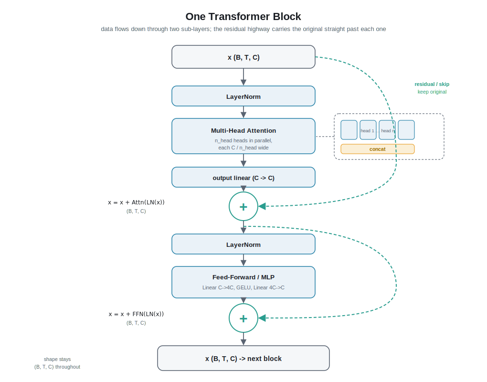

# Chapter 4 - The Transformer Block




In [Chapter 3](03-self-attention.md) you built **one attention head**: a mechanism that lets each character look back at earlier characters and pull in the ones that matter. That is the beating heart of a Transformer. But a heart is not a body. This chapter assembles the rest of the organs and wires them into one repeatable unit called a **block**. Stack a few blocks and you have a working GPT.

All of this lives in `nanobdh/model_gpt.py`.

## 1. The plain-English intro

Imagine a newsroom writing one shared story. A single reporter (one attention head) is good, but narrow: they only chase one kind of lead. So you hire **several reporters at once**, each with a different beat. One tracks *who is speaking*, one tracks *punctuation and line breaks*, one tracks *rhyme*, one tracks *which character was mentioned three lines ago*. They all read the same draft in parallel, each writes their notes, and an editor staples the notes together. That is **multi-head attention**.

Then those combined notes go to a **rewrite desk** (a small "thinking" step) where each position privately digests what it just learned. That is the **feed-forward** part.

Two more office rules keep the newsroom from descending into chaos:

- **Nobody throws away the original draft.** Every reporter's edit is added *on top of* the draft, not swapped in for it. If an edit turns out useless, the original still survives. That "keep the original and add to it" rule is a **residual connection**.
- **Before each round, everyone re-centers on the same page format** so no single loud voice drowns everyone out. That tidying step is **LayerNorm**.

One full pass through this newsroom (attention, then rewrite, with both office rules applied) is **one Transformer block**. GPT just runs the same newsroom several times in a row, each time on a slightly better draft.

## 2. From zero: every piece defined

We are working character by character on TinyShakespeare. Recall our notation: **B** = batch size (how many text chunks we process at once), **T** = block/context length (how many characters the model can see at a time, e.g. 256), **C** = embedding dimension (how many numbers describe each character's "meaning", e.g. 128 or 384), and **V** = vocab size (~65, the number of distinct characters).

At the start of a block, our text is a tensor of shape **(B, T, C)**: for each of B chunks, for each of T character positions, a C-number vector holding what we know about that position so far.

### Piece 1: Multiple heads in parallel

A **head** is one attention operation (Chapter 3). It takes each position's vector and lets it gather information from earlier positions. One head can only learn *one* kind of "what should I pay attention to".

A **multi-head** setup runs `n_head` of these side by side. The trick that keeps it cheap: we do **not** give each head the full C dimensions. We split C into `n_head` equal slices, each of size `head_size = C / n_head`. With C = 384 and `n_head` = 6, each head works in its own little 64-dimensional world.

- Each head independently computes its attention over the T positions.
- Each head outputs a (B, T, head_size) result.
- We **concatenate** the heads back together along the last axis, giving (B, T, C) again.
- A final small linear layer (the "editor stapling notes together") mixes the concatenated heads so they can talk to each other.

Why bother with many small heads instead of one big one? Different heads specialize. In a trained model you can literally see one head that attends to the immediately previous character, another that jumps to the matching open-quote, and so on. Parallel specialists beat one generalist, at the same total cost.

> **Linear layer** (also called a fully-connected or dense layer): the simplest learnable transformation. It multiplies the input vector by a matrix of weights and adds a bias. In `model_gpt.py` this is `nn.Linear`. It reshapes information from one size to another and is where a lot of the learning lives.

### Piece 2: Residual (skip) connections and why they help training

A **residual connection** (or **skip connection**) means: instead of replacing `x` with the output of some layer `f(x)`, we compute

```
x = x + f(x)
```

The layer only has to learn the **change** (the "residual") to apply to `x`, not rebuild `x` from scratch. The original signal takes a free highway around the layer.

Why this matters so much for training: neural networks learn by sending an error signal backwards from the output through every layer (**backpropagation**, Chapter 6). In a deep stack, that signal gets multiplied at each layer and can shrink toward zero (the **vanishing gradient** problem), so the early layers barely learn. A residual connection gives the error signal a direct add-path straight back to earlier layers, so it arrives strong and undiluted. In practice this is the single change that made very deep networks trainable at all. Without residuals, even a 6-layer GPT trains badly; with them, it just works.

There is an intuition too: a block that has nothing useful to add can learn `f(x) ≈ 0`, and then `x + f(x) ≈ x` simply passes the draft through untouched. Starting from "do no harm" is a great place to learn from.

### Piece 3: LayerNorm

**Normalization** means rescaling a set of numbers so they have a consistent, tame range (roughly: average of 0, spread of 1). If some numbers in a vector are huge and others tiny, the math downstream gets unstable and training wobbles.

**LayerNorm** does this normalization **per position, across that position's C features**. For one character's C-vector, it computes the mean and standard deviation of those C numbers, subtracts the mean, divides by the standard deviation, then applies two learned knobs (a scale and a shift, one pair per feature) so the model can undo the normalization if it prefers. Crucially it normalizes *each token independently* and does not mix information across the T positions or across the B batch, so it behaves identically during training and generation.

Where does it go? In our modern GPT (following GPT-2 and nanoGPT) we use **pre-norm**: LayerNorm is applied to `x` *before* it enters attention and *before* it enters the feed-forward, while the residual highway stays clean:

```
x = x + attention(LayerNorm(x))
x = x + feedforward(LayerNorm(x))
```

This keeps the residual path free of any normalization, which is exactly what makes the gradient highway so effective. `model_gpt.py` uses `nn.LayerNorm(C)`.

### Piece 4: The position-wise MLP / feed-forward

After attention has *gathered* information between positions, each position needs a moment to *think* about what it gathered. That is the **feed-forward network**, also called the **MLP** (multi-layer perceptron).

It is tiny and applied **position-wise**: the exact same small network runs on each of the T positions independently, with no mixing between positions (attention already did the mixing; this step is private per character). It has three steps:

1. **Expand**: a linear layer grows the vector from C up to `4 * C` (the standard 4x from the original Transformer). More room to compute intermediate features.
2. **Nonlinearity**: an activation function, **GELU** in GPT-2 (a smooth cousin of ReLU). Without a nonlinearity, stacking linear layers would collapse into a single linear layer and the model could not represent anything interesting.
3. **Project back**: a linear layer shrinks `4 * C` back down to C, so the output slots back onto the residual highway.

> **Activation function**: a simple bend applied to each number, like "keep positives, squash negatives". It is what lets a network learn curved, non-straight-line relationships. **ReLU** = `max(0, x)`; **GELU** is a smoother version. (Keep ReLU in mind: it becomes central for the BDH model in Chapter 8.)

### Piece 5: How a block stacks these

One **Transformer block** is exactly:

```
x = x + MultiHeadAttention(LayerNorm(x))   # gather info between positions
x = x + FeedForward(LayerNorm(x))          # think, position by position
```

Two sub-layers, each wrapped in its own LayerNorm and its own residual add. The block takes (B, T, C) in and returns (B, T, C) out, unchanged in shape. Because the shape is preserved, blocks are **stackable**: the output of one is a valid input to the next.

A full GPT is then: embed the characters (Chapter 2), run `n_layer` identical blocks in sequence, apply one **final LayerNorm**, and feed the result to the **LM head** (a linear layer mapping C to V) that produces a score for each of the ~65 possible next characters (Chapter 5 covers the head and loss). In `model_gpt.py` the blocks are held in an `nn.ModuleList` (or `nn.Sequential`) named something like `self.blocks`, one `Block` module per layer.

## 3. Deeper dive

### Shapes, end to end through one block

Input `x`: **(B, T, C)**.

Multi-head attention, with `head_size = C / n_head`:

- LayerNorm(x) leaves shape (B, T, C).
- Query/Key/Value projections: three `nn.Linear(C, C)` produce q, k, v each (B, T, C), then reshape to (B, n_head, T, head_size) so the heads are a batched dimension.
- Attention scores `q @ k.transpose(-2, -1)` give (B, n_head, T, T), scaled by `1/sqrt(head_size)`, masked causally (a lower-triangular mask so position t cannot see positions > t), then softmaxed over the last T.
- Weighted sum with v: (B, n_head, T, head_size). Transpose and reshape back to (B, T, C).
- Output projection `nn.Linear(C, C)`: (B, T, C).
- Residual add: `x = x + that`. Still (B, T, C).

Feed-forward:

- LayerNorm(x): (B, T, C).
- `nn.Linear(C, 4*C)`: (B, T, 4C).
- GELU: (B, T, 4C).
- `nn.Linear(4*C, C)`: (B, T, C).
- Residual add: `x = x + that`. Still (B, T, C).

The shape is an invariant: **(B, T, C) in, (B, T, C) out**. This is the whole reason `n_layer` blocks compose trivially.

### Why the 1/sqrt(head_size) scale and the split into heads

Splitting C across heads keeps the total compute of multi-head attention the same as a single full-width head, while buying representational diversity for free. The `1/sqrt(head_size)` factor keeps the dot-product scores from growing large as head_size grows; large scores push softmax into near-one-hot regions where gradients vanish, so the scale keeps attention learnable. This is the "scaled" in "scaled dot-product attention" from Vaswani et al. (2017).

### Pre-norm vs post-norm (a real design choice)

The original 2017 Transformer used **post-norm**: `x = LayerNorm(x + f(x))`, normalization *after* the residual add. GPT-2 and nanoGPT switched to **pre-norm**: `x = x + f(LayerNorm(x))`. The reason is the gradient highway. In post-norm, the LayerNorm sits *on* the residual path, so gradients get rescaled every layer and deep stacks need careful learning-rate warmup to avoid blowing up. In pre-norm the residual path is a clean sum of every block's contribution, gradients flow back untouched, and training is far more forgiving. For our small char-level model on a Mac (MPS) this stability is worth a lot: we want it to just train. `model_gpt.py` follows the pre-norm layout, and adds the single final LayerNorm before the LM head, which pre-norm architectures need because the residual stream is never normalized on the way out.

### Why the MLP is where "knowledge" lives

Attention *moves* information; the MLP *transforms* it. The 4x expansion is a lot of parameters: for C = 384, each block's MLP is roughly `2 * (384 * 1536) ~= 1.2M` weights, which is roughly double the attention projections (about 0.6M) and makes up the bulk of the block's parameters. Empirically the feed-forward layers are where much of a model's factual and pattern knowledge is stored. It is position-wise (shared across all T positions) so it stays cheap and generalizes across the sequence, which matters at our T of 256 characters.

### Parameter count sketch (per block)

With embedding dim C, one block holds roughly:

- Attention: 4 matrices of C x C (q, k, v, output) ~= `4 * C^2`.
- Feed-forward: `C * 4C + 4C * C = 8 * C^2`.
- LayerNorms and biases: negligible.

So each block is about `12 * C^2` parameters. For C = 384 that is ~1.77M per block; with `n_layer` = 6 the blocks alone are ~10.6M, on the order of a small nanoGPT you can train on a MacBook. Character-level vocab (V ~= 65) keeps the embedding and LM-head cheap, so the blocks dominate the parameter budget.

### One subtlety: dropout

`model_gpt.py` typically sprinkles **dropout** (randomly zeroing a fraction of activations during training only) after attention, after the MLP, and on the attention weights. It is a regularizer: it stops the model memorizing the training text and forces redundancy. On a dataset as small as TinyShakespeare this matters, since the model is big enough to overfit. Dropout is active only in training mode and is fully disabled during generation.

## 4. New terms recap

- **Transformer block**: one repeatable unit = multi-head attention + feed-forward, each with its own LayerNorm and residual connection. Preserves shape (B, T, C), so blocks stack.
- **Multi-head attention**: run `n_head` small attention heads in parallel (each of size C / n_head), concatenate their outputs, then mix with a linear layer.
- **Head size**: `C / n_head`, the width each individual head operates in.
- **Residual (skip) connection**: `x = x + f(x)`; the layer learns only the change, and the original signal takes a free path that keeps gradients flowing in deep networks.
- **Vanishing gradient**: the problem where the backward learning signal shrinks toward zero across many layers; residuals fix it.
- **LayerNorm**: per-position rescaling of a token's C features to mean 0, spread 1, plus learned scale and shift; stabilizes training.
- **Pre-norm vs post-norm**: whether LayerNorm is applied before the sub-layer (GPT-2 / our choice) or after the residual add (original 2017 Transformer).
- **Feed-forward / MLP**: position-wise little network (expand to 4C, nonlinearity, project back to C) where each position privately processes what attention gathered.
- **Linear layer**: a learnable matrix multiply plus bias (`nn.Linear`) that reshapes information.
- **Activation function / GELU / ReLU**: the nonlinear bend that lets the network learn curved relationships.
- **Dropout**: randomly zeroing activations during training to prevent overfitting.

---

**Next:** [Chapter 5 - The full GPT: LM head and loss](05-full-gpt.md): we stack `n_layer` blocks, add the final LayerNorm and the V-way output head, and turn the model's scores into a next-character prediction we can train.