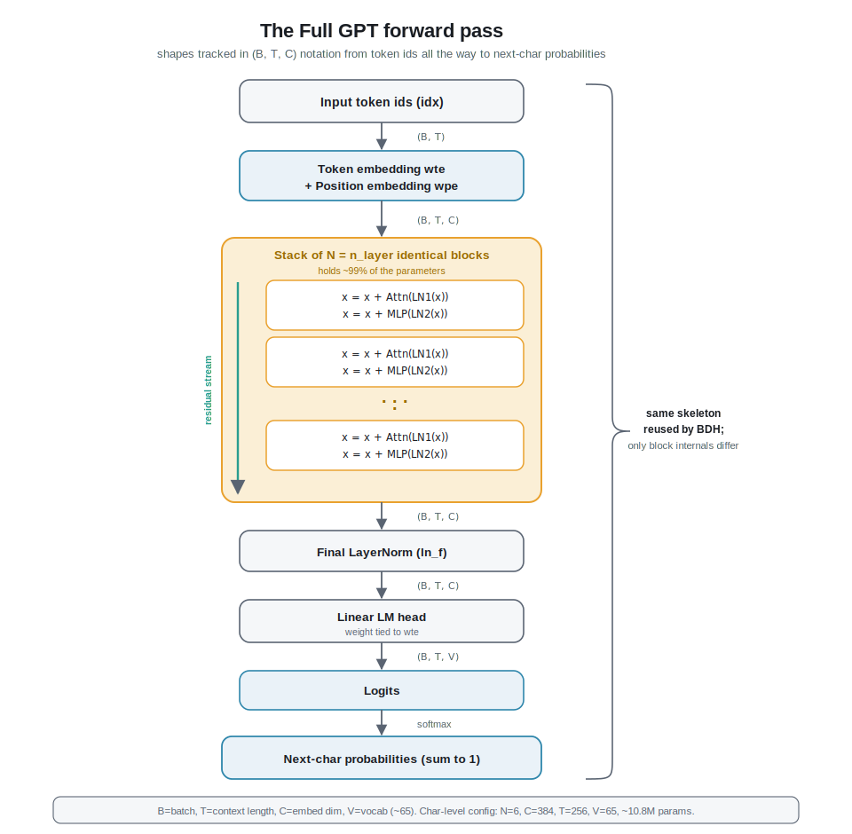

# Chapter 05 - The Full GPT




> Code for this chapter lives in `nanobdh/model_gpt.py`. The training loop that uses it is `nanobdh/train.py`, and generation is `nanobdh/sample.py`.

## 1. The everyday picture

Imagine an assembly line in a factory. A rough part comes in one end. It passes through a row of identical workstations. Each station does not build the whole thing; it just improves the part a little and hands it to the next station. By the end of the line, after many small improvements, the part is finished and ready to ship.

A full GPT is exactly this assembly line for meaning.

- The "rough part" is your text, already turned into a list of vectors (numbers that carry meaning). That step happened in Chapters 1 and 2.
- Each "workstation" is a **Transformer block** (Chapters 3 and 4 built one). It looks at the sequence and refines every position a little.
- We stack N identical workstations in a row. More stations means more refinement.
- At the very end there is a **finishing station** and a **labeler** that reads the finished part and shouts out its best guess for the next character.

This chapter is about the whole line: how we stack the blocks, what the final two steps do, how a batch of text flows through end to end, and how to count every number the model has to learn and say where each one lives.

## 2. From zero: building the full model

Let me define the words as they appear. If a term feels heavy, it will be pinned down in plain language right where it shows up.

### The pieces you already have

- A **token** is one character turned into an integer id. On TinyShakespeare there are about 65 unique characters, so ids run 0 to 64. That count is the **vocabulary size**, written **V**. This lives in `nanobdh/tokenizer.py`.
- An **embedding** is a lookup table that turns each integer id into a **vector** (a fixed-length list of numbers). The length of that vector is the **embedding dimension**, written **C**. So one character becomes C numbers that the model can shape into "meaning".
- A **Transformer block** is the workstation. Inside it, **self-attention** lets each position look back at earlier positions and gather context, and a small two-layer network called an **MLP** (multi-layer perceptron, just "a couple of matrix multiplies with a squiggle in between") does per-position thinking. A block takes in a sequence of vectors and returns a sequence of the same shape, only refined.

### Step one: stack N blocks

"Stacking" means: run block 1, feed its output into block 2, feed that into block 3, and so on for **N** blocks. **N is called `n_layer`.** Every block has the same shape and the same job, but each has its own separate learned numbers, so each learns to do a different piece of the refinement. Early blocks tend to pick up simple, local patterns (this letter follows a space, so it is probably a capital), and later blocks build more abstract structure (we are inside a character's spoken line).

Crucially, a block does not replace its input. It adds a correction on top of it (this is the **residual connection** from Chapter 4: `x = x + block(x)`). So information flows straight down the whole stack like a conveyor belt, and each block only nudges it. That is why stacking many blocks is stable instead of turning the signal to mush.

### Step two: the final LayerNorm

After the last block we do one more **LayerNorm**. LayerNorm ("layer normalization") is a cleanup step: for each position it rescales the C numbers so they have a tidy, consistent size (roughly mean zero, spread one), then applies a learned scale and shift. Analogy: before the labeler reads the part, we wipe it down and put it under standard lighting so the reading is fair no matter how bright or dim the part came off the line. Without this final normalization the numbers coming out of a deep stack can drift to wildly different scales, and the next step would misread them.

### Step three: the linear head to vocab logits

The last station is the **language-model head** (the "LM head"). It is a single **linear layer**: a matrix multiply that turns each position's C-number vector into V numbers, one score per possible next character. Those V raw scores are called **logits**. A logit is just an unnormalized score; higher means "more likely", but the numbers are not yet probabilities.

To read them as probabilities we apply **softmax**, which squashes the V logits into V positive numbers that add up to 1. Now the model is literally saying "next char is 'e' with probability 0.71, 'a' with 0.05, ...". Picking a character from that distribution is generation, and that happens in `nanobdh/sample.py`.

That is the entire model: embed, stack of N blocks, final LayerNorm, linear head to logits. Everything else is detail.

### The forward pass, told as a story

The **forward pass** is one trip of data through the model, input to logits. For a chunk of Shakespeare:

1. Take the character ids.
2. Look up each id in the token embedding table to get its meaning vector, and add a position vector so the model knows the order.
3. Send the sequence through block 1, then block 2, ... then block N. Each block refines it.
4. Apply the final LayerNorm.
5. Apply the linear head to get, for every position, a score for each of the ~65 possible next characters.

During training (`nanobdh/train.py`) we compare those scores to the actual next characters and compute the **loss** (a single number saying how wrong we were), then nudge the model. During generation we only care about the scores at the last position, because that is the prediction for what comes next.

## 3. Deeper dive

Now the real mechanics, with shapes. Notation: **B** = batch size (how many independent text chunks we process at once), **T** = block size / context length (how many characters in each chunk, the most the model can look back), **C** = embedding dim, **V** = vocab size, plus `n_head` and `n_layer`.

We will use the standard Karpathy char-level config for concreteness:

```
vocab_size  V       = 65
block_size  T       = 256
n_embd      C       = 384
n_head              = 6
n_layer     N       = 6
```

### Shapes through the forward pass

In `nanobdh/model_gpt.py` the `GPT.forward` method carries a tensor `x` whose shape you can track the whole way:

| Step | Operation | Shape of the tensor |
|---|---|---|
| input ids | `idx` | (B, T) |
| token embed | `wte(idx)` | (B, T, C) |
| position embed | `wpe(pos)` broadcast-added | (B, T, C) |
| each of N blocks | `x = x + attn(ln1(x))`, `x = x + mlp(ln2(x))` | (B, T, C) |
| final LayerNorm | `ln_f(x)` | (B, T, C) |
| LM head | `lm_head(x)` | (B, T, V) |

So the output **logits** have shape (B, T, V). Read that as: for each of the B chunks, for each of the T positions, a score over all V next-character options. Position t's logits are the prediction for the character at position t+1. That is why one training example of length T gives T supervised predictions at once (the model predicts every next char in parallel, made honest by the causal mask from Chapter 3 that stops any position from peeking at the future).

At generation time `sample.py` only needs the last slice, `logits[:, -1, :]` of shape (B, V), because it is extending the text by one character.

### Why LayerNorm at the very end, and why "pre-norm"

Modern GPT (following GPT-2, Radford 2019) uses **pre-norm** blocks: LayerNorm is applied to the input of each sub-layer, inside the residual branch (`x + attn(ln1(x))`), rather than after it. The consequence is that the residual stream itself (the `x` running down the conveyor) is never normalized in the middle. By the time it exits block N its scale is undefined, so we need one **final LayerNorm** (`ln_f`) to standardize it before the head reads it. This is exactly the pattern in nanoGPT, and it is why `model_gpt.py` has a single `ln_f` after the `nn.ModuleList` of blocks and before `lm_head`. Vaswani 2017's original Transformer used post-norm and no final LN; GPT-2 moved the norms to the front and added the trailing one because it trains far more stably at depth.

### Weight tying: the head shares the embedding table

Here is a choice that surprises people. The token embedding `wte` is a (V, C) matrix: turn an id into a C-vector. The LM head is a (C, V) linear map: turn a C-vector into V scores. Those are transposes of the same shape. GPT-2 **ties** them, meaning `wte.weight` and `lm_head.weight` are literally the same parameter object (there is only one matrix, used both to embed and to score). So in `model_gpt.py` you will see `self.transformer.wte.weight = self.lm_head.weight`, the same idiom nanoGPT uses to point the embedding table at the head's weight.

Why: the intuition is that "which vector represents character e" and "how much does this vector vote for e" are two views of the same relationship, so sharing them saves V\*C parameters and tends to improve results. On our config that is 65\*384 = 24,960 shared numbers instead of doubled.

### Counting parameters and where they live

A **parameter** is a single learned number (one weight or one bias). Counting them tells you the model's size and where its capacity sits. Here is the full accounting for our config, computed exactly the way the modules in `model_gpt.py` allocate them.

Per Transformer block:

| Sub-part | Formula | Count |
|---|---|---|
| LayerNorm 1 (weight + bias) | 2C | 768 |
| Attention QKV projection | C\*3C + 3C | 443,520 |
| Attention output projection | C\*C + C | 147,840 |
| LayerNorm 2 (weight + bias) | 2C | 768 |
| MLP up-projection (C to 4C) | C\*4C + 4C | 591,360 |
| MLP down-projection (4C to C) | 4C\*C + C | 590,208 |
| Block total | | 1,774,464 |

The MLP holds the most (about 1.18M of the 1.77M per block, roughly two thirds), because the hidden layer is 4\*C wide. Attention is the next chunk. The LayerNorms are almost free.

Now the whole model:

| Component | Formula | Count |
|---|---|---|
| Token embedding `wte` | V\*C | 24,960 |
| Position embedding `wpe` | T\*C | 98,304 |
| N=6 blocks | 6 \* 1,774,464 | 10,646,784 |
| Final LayerNorm `ln_f` | 2C | 768 |
| LM head | tied, shares `wte` | 0 |
| **Total** | | **~10,770,816 (about 10.8M)** |

Takeaways from the numbers:

- The stack of blocks is essentially the entire model (about 10.65M of 10.77M). Depth and width, not the embeddings, hold the knowledge.
- Within a block, the MLP dominates, then attention; the norms are rounding error.
- Because the head is tied to `wte`, adding vocabulary is cheap here, but widening C or adding layers scales the cost fast: block cost grows with C squared, and total block cost grows linearly with `n_layer`.
- nanoGPT's own `get_num_params()` reports a slightly smaller "non-embedding" figure because it subtracts the position embedding by convention; the underlying weights are the same ones counted above.

A useful sanity habit: after building the model in `model_gpt.py`, sum `p.numel() for p in model.parameters()` and check it lands near 10.8M for this config. If it is off by 24,960 you probably forgot to tie the head; if it is off by a whole block you miscounted `n_layer`.

### How this differs for BDH

Keep this shape story in mind, because Chapter 8's BDH model (`nanobdh/model_bdh.py`) keeps the same outer skeleton (embed, a stack of layers, final norm, linear head to V logits, same (B, T, V) output) but replaces the inside of each block with ReLU low-rank feed-forward and linear attention over a much larger neuron dimension. The end-to-end forward pass and the parameter-counting discipline transfer directly; only the block internals change.

## 4. New terms

- **n_layer (N):** how many Transformer blocks are stacked in a row.
- **Stacking:** feeding each block's output into the next, so refinements accumulate.
- **Final LayerNorm (`ln_f`):** the single normalization applied after the last block, before the head, needed because pre-norm leaves the residual stream unscaled.
- **LM head:** the final linear layer mapping each C-vector to V scores.
- **Logits:** raw, unnormalized next-character scores (shape (B, T, V)); softmax turns them into probabilities.
- **Forward pass:** one trip of data from input ids to output logits.
- **Weight tying:** making the LM head reuse the token embedding matrix, saving V\*C parameters.
- **Parameter:** a single learned number (a weight or a bias); their total is the model size.
- **Residual stream:** the running vector `x` that each block adds a correction to rather than overwriting.