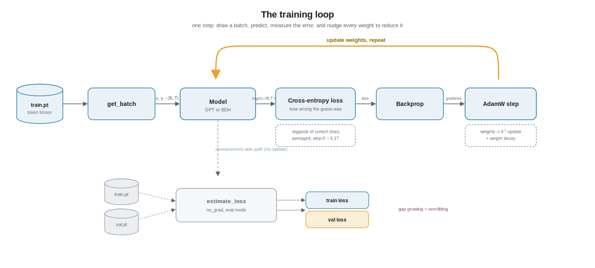

# Chapter 6 - Training




> Reference code: `nanobdh/train.py` (the training loop), with data coming from `data/prepare.py` and models from `nanobdh/model_gpt.py` and `nanobdh/model_bdh.py`.

## 1. The plain-English idea

Imagine teaching a kid to spell by covering the next letter in a word and asking them to guess it. They say a letter. You do not just say "wrong" - you tell them **how badly** they missed. If the real letter was `e` and they were almost sure it was `e`, that is a tiny mistake. If they were sure it was `z`, that is a big mistake. Every time, you gently correct their instinct so that next time their guess leans a little more toward the truth.

Training a language model is exactly this, done millions of times, automatically:

1. Show the model some real Shakespeare text.
2. Let it guess the next character at every position.
3. Measure how wrong the guesses were with a single number (the **loss**).
4. Nudge every knob inside the model a tiny bit so the loss would have been smaller.
5. Repeat.

That is the whole game. This chapter is about the three tools that make it work: a way to **measure** wrongness (cross-entropy loss), a way to **nudge** the knobs (the AdamW optimizer), and the **loop** that repeats it, plus how we tell whether the model is genuinely learning or just cheating (train vs val loss, overfitting vs underfitting).

## 2. From zero: every term as it appears

### What the model actually outputs

Our model looks at the last few characters and, for the next position, produces a **score for every possible character**. Since TinyShakespeare has about 65 distinct characters (our vocabulary, size `V`), the model outputs 65 raw scores. These raw scores are called **logits** - just unbounded numbers, one per candidate character, where bigger means "more likely" in the model's opinion.

Raw scores are hard to reason about, so we squash them into **probabilities**: 65 numbers between 0 and 1 that add up to 1. The function that does this is **softmax**. Think of softmax as turning a pile of opinion-scores into a proper betting distribution. `{'e': 0.71, 'a': 0.05, ...}` means "I am 71% sure the next character is e".

### Cross-entropy loss: measuring how wrong

We know the real next character (the training text tells us). Say it is `e`. The model gave `e` a probability of 0.71. **Cross-entropy loss** for that one prediction is:

```
loss = -log(probability the model gave to the correct character)
     = -log(0.71) = 0.34
```

Why this formula? Read it in plain words: **loss is how surprised the model was by the truth.**

- If the model was certain and right (probability near 1.0), `-log(1.0) = 0`. No surprise, no loss. 
- If the model gave the correct character only 0.5, `-log(0.5) = 0.69`. Mild surprise.
- If it was confidently wrong and gave the correct character 0.01, `-log(0.01) = 4.6`. Huge surprise, huge loss.

The `-log` shape is the point: being confidently wrong is punished far more than being unsure. This pushes the model not just to be right, but to be **calibrated** - confident only when it should be.

The total training loss is just the **average** of this per-character surprise over every position we predicted. One number. Lower is better.

**A sanity anchor you will actually use.** Before training, the model knows nothing, so it spreads its bet evenly: probability `1/65` for each character. Cross-entropy is then `-log(1/65) = log(65) ≈ 4.17`. So when you launch `nanobdh/train.py` and the very first loss prints around **4.1**, that is correct and healthy. It means "the model is currently guessing uniformly at random", exactly as expected. If step 0 loss is wildly off (say 12), something is broken (bad initialization, wrong vocab size). This single check catches a huge fraction of bugs.

### The optimizer: how we nudge the knobs

The model is just a big pile of numbers called **parameters** or **weights** (the embedding tables, the attention projections, the MLP matrices). "Learning" means finding weight values that make the loss small.

To know which way to nudge each weight, we compute the **gradient**: for every single weight, a number saying "if you increase this weight a hair, does the loss go up or down, and how steeply?" Computing all these at once is **backpropagation** (covered around the model chapters). The gradient is a compass pointing uphill; we want to walk **downhill**, so we step in the opposite direction. This is **gradient descent**.

How big a step? That is the **learning rate**, the single most important knob in all of training.

- Learning rate too **big**: you overshoot the valley, the loss bounces around or explodes to `NaN` (short for "not a number", the broken value math produces from things like dividing infinity by infinity). Like trying to walk downhill in giant leaps and flying off a cliff.
- Learning rate too **small**: you inch along, training takes forever.
- For our tiny char model, something like `3e-4` (0.0003) is a sane starting point.

Plain gradient descent uses the same step size for every weight forever. **Adam** is smarter: it keeps a running memory of each weight's recent gradients, so weights with consistently large gradients take smaller, calmer steps and rarely-updated weights take relatively larger ones. It adapts per weight. **AdamW** is Adam plus **weight decay**, a gentle force that pulls every weight slightly toward zero each step. Weight decay discourages any single weight from growing huge, which keeps the model simpler and helps it generalize. AdamW is the standard optimizer for GPT-style training and is what `nanobdh/train.py` uses for both models.

### The training loop

Now assemble the pieces. One pass through this loop is one **step** (or **iteration**):

1. **Get a batch.** We do not feed the whole corpus at once. We grab `B` random windows of `T` characters each from `train.pt`. `B` is the **batch size** (how many examples per step, say 32 or 64), `T` is the **block size** or context length (how many characters the model sees, say 128 or 256). More examples per step gives a smoother, more reliable gradient.
2. **Forward pass.** Run the batch through the model to get logits, then compute the cross-entropy loss.
3. **Backward pass.** Backpropagation fills in the gradient for every weight.
4. **Optimizer step.** AdamW nudges every weight a learning-rate-sized step downhill, then applies weight decay.
5. **Zero the gradients** and repeat.

Every few hundred steps we pause and print the loss so we can watch it fall. That brings us to the honesty check.

### Train loss vs validation loss

Remember from `data/prepare.py` that we split the corpus 90/10 into `train.pt` and `val.pt`, and we **never** train on the val slice. That held-out slice is our lie detector.

- **Train loss**: how wrong the model is on text it is actively learning from. It can drop by simply memorizing.
- **Validation (val) loss**: how wrong it is on Shakespeare it has never been shown. This measures whether it learned the **patterns of the language** (which transfer to new text) rather than memorizing specific passages.

We care about val loss. Train loss can always be driven down; val loss only drops if the model genuinely generalizes.

### Overfitting vs underfitting

Watch the two curves together:

- **Underfitting**: both train and val loss are high and still falling, or plateau high. The model has not learned enough yet. It is too weak, or you have not trained long enough. Fix: train longer, or make the model bigger.
- **Overfitting**: train loss keeps dropping but val loss **stops falling and starts rising**. The model is now memorizing the training text (including its noise) instead of learning transferable patterns. It is like a student who memorized the answer key instead of understanding the subject: perfect on the practice test, lost on the real exam. Fix: more data, weight decay, dropout (randomly switching off a fraction of the model's internal signals during training so it cannot lean too hard on any single one), a smaller model, or just stop training at the point where val loss bottomed out.

The sweet spot is right where val loss is lowest. That gap between a low train loss and a higher val loss is the tell-tale sign of overfitting starting.

### Why we tune hyperparameters

**Hyperparameters** are the settings you choose **before** training that the optimizer does not learn for you: learning rate, batch size `B`, context length `T`, embedding dim `C`, number of heads `n_head`, number of layers `n_layer`, weight decay, and how many steps to train. The model learns its **weights**; you choose its **hyperparameters**.

They matter because there is no single correct value. Too big a model on our tiny 1 MB corpus overfits fast. Too small underfits. Too high a learning rate diverges. Tuning means running short experiments, watching the train and val curves, and adjusting. This is the craft of training, and it is why `nanobdh/train.py` exposes these as command-line flags so you can sweep them.

## 3. Deeper dive

### Shapes, end to end, in B/T/C/V notation

Follow one batch through `nanobdh/train.py`:

- `get_batch` slices `B` random windows from the 1-D token tensor in `train.pt`. It returns:
  - `x` of shape `(B, T)` - the input character ids.
  - `y` of shape `(B, T)` - the targets, which are `x` shifted left by one. So `y[:, t]` is the character that truly follows `x[:, t]`. This shift is why one window gives us `T` supervised predictions at once, not just one: every position predicts its own successor. This is the self-supervised trick from Chapter 0.
- The model maps `(B, T)` ids to logits of shape `(B, T, V)`: for each of the `B` sequences, at each of the `T` positions, a score over all `V` characters.
- Cross-entropy needs 2-D logits and 1-D targets, so we reshape: logits to `(B*T, V)` and targets to `(B*T,)`. In PyTorch this is one call:

```python
loss = F.cross_entropy(logits.view(-1, V), targets.view(-1))
```

`F.cross_entropy` fuses softmax and negative-log-likelihood in one numerically stable operation (it never materializes the probabilities, it works in log-space to avoid overflow). It averages over all `B*T` positions, returning a single scalar. That scalar is what we backprop from.

### Why softmax then negative log, and why fuse them

Doing `log(softmax(x))` naively can overflow or underflow when logits are large. The fused cross-entropy uses the log-sum-exp trick internally. This is why you should feed **raw logits**, never pre-softmaxed probabilities, into `F.cross_entropy`. A classic beginner bug is applying softmax yourself and then calling cross-entropy on top, which double-counts and trains poorly.

### The optimizer step, mechanically

AdamW keeps two running averages per parameter: the first moment `m` (mean of recent gradients, momentum) and the second moment `v` (mean of recent squared gradients, magnitude). The update is roughly:

```
step_for_this_weight = lr * m_hat / (sqrt(v_hat) + eps)
weight = weight - step_for_this_weight - lr * weight_decay * weight
```

The `m_hat / sqrt(v_hat)` ratio is the key: it normalizes each weight's step by how noisy that weight's gradient has been, so every parameter moves at a comparable effective pace regardless of its raw gradient scale. The trailing `lr * weight_decay * weight` term is the **decoupled** weight decay that distinguishes AdamW from plain Adam: it shrinks weights directly rather than folding decay into the gradient, which is why it regularizes more cleanly. Typical settings for a small model: `betas=(0.9, 0.95)`, `weight_decay=0.1`, `eps=1e-8`.

### Learning rate over time: warmup and decay

A fixed learning rate works for a quick demo, but real GPT training (nanoGPT included) uses a **schedule**: a short **warmup** where the learning rate ramps from 0 up to its peak over the first few hundred steps (so early, chaotic gradients do not blow up freshly initialized weights), followed by a **cosine decay** down toward a small floor (so late in training you take fine, careful steps and settle into the valley). In `nanobdh/train.py` this is optional and off by default for simplicity, but it is why the same peak learning rate can behave very differently with vs without a schedule.

### Estimating loss honestly

Printing the loss of a single training batch is noisy - one lucky or unlucky window swings it. So `nanobdh/train.py` uses an `estimate_loss` routine that:

1. Switches the model to eval mode with `model.eval()` (this disables dropout so evaluation is deterministic; we flip back with `model.train()` after).
2. Wraps everything in `torch.no_grad()` so no gradients are tracked (faster, less memory - we are only measuring, not learning).
3. Averages the loss over several batches from **both** `train.pt` and `val.pt`, giving one stable train number and one stable val number to log side by side.

This is the moment the train-vs-val gap becomes visible and you can spot overfitting.

### Device and reproducibility notes

We move the model and each batch to **MPS** (Apple's GPU backend) when available, else CPU, since this is built to run on a Mac. Two practical gotchas: MPS prefers `float32` and some ops silently fall back to CPU, so wall-clock speed varies; and we seed the random number generator (RNG) with `torch.manual_seed` so batches and initialization are reproducible run to run, which is essential when comparing GPT vs BDH fairly - same data order, same init randomness, only the architecture differs.

### Why the same loop trains both GPT and BDH

Notice that nothing in this chapter mentions attention or neuron fields. That is deliberate. Cross-entropy, AdamW, batching, and the train/val split are **architecture-agnostic**. `nanobdh/train.py` takes `--model gpt|bdh` and runs the identical loop over either `nanobdh/model_gpt.py` or `nanobdh/model_bdh.py`. Both expose the same interface: take `(B, T)` ids, return `(B, T, V)` logits and a loss. Keeping the training harness shared is what makes the Chapter 9 comparison honest - any difference in the loss curves comes from the model, not from how we trained it.

## 4. New terms recap

- **Logits**: the raw, unbounded scores the model outputs, one per possible character (`V` of them).
- **Softmax**: turns logits into probabilities that sum to 1.
- **Cross-entropy loss**: `-log(probability given to the correct character)`, averaged over all predicted positions. Measures the model's surprise at the truth. Lower is better; random guessing on our vocab is about 4.17.
- **Parameters / weights**: the numbers inside the model that learning adjusts.
- **Gradient**: for each weight, the direction and steepness of loss change. Backpropagation computes it.
- **Gradient descent**: stepping weights in the downhill (negative-gradient) direction.
- **Learning rate**: how big each downhill step is. The most important knob.
- **Adam / AdamW**: an adaptive optimizer that gives each weight its own effective step size; AdamW adds decoupled weight decay.
- **Weight decay**: a gentle pull of weights toward zero that fights overfitting.
- **Dropout**: randomly switching off a fraction of the model's internal signals during training so it cannot over-rely on any single one; another guard against overfitting.
- **Batch size (B)**: how many windows per training step. **Block size / context length (T)**: how many characters the model sees at once.
- **Step / iteration**: one full forward, backward, optimizer update.
- **Train loss vs validation loss**: wrongness on data it learns from vs held-out data it never trains on; val loss is the honesty check.
- **Overfitting**: train loss falls but val loss rises (memorizing). **Underfitting**: both stay high (not learned enough).
- **Hyperparameters**: settings you choose before training (learning rate, `B`, `T`, `C`, `n_head`, `n_layer`, weight decay, steps), as opposed to weights the model learns.
- **Warmup / cosine decay**: a learning-rate schedule that ramps up then eases down.

---

**Next:** Chapter 7 - Generation (`nanobdh/sample.py`): now that the weights are trained, we freeze them and run the pipeline forward to actually write Shakespeare, one character at a time, using temperature and top-k sampling.