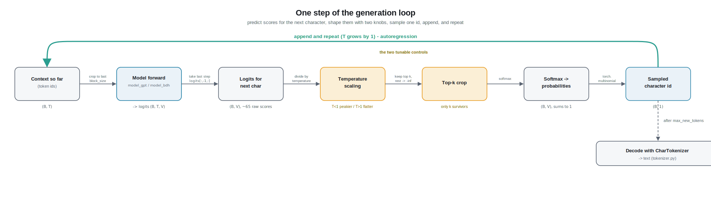

# Chapter 7 - Sampling (how the model actually writes)




> Code for this chapter: `nanobdh/sample.py`. It uses the trained model from
> `nanobdh/model_gpt.py` (or `nanobdh/model_bdh.py`) and the vocabulary from
> `nanobdh/tokenizer.py`.

## 1. The everyday picture

Imagine you are texting on your phone and the little bar above the keyboard
suggests the next word. You tap one, another suggestion appears, you tap again,
and word by word a sentence builds itself. You never write the whole message in
one go; you pick one piece, then let the next piece depend on everything you
have picked so far.

That is exactly how our model writes Shakespeare. It never spits out a whole
play. It guesses **one character**, sticks it on the end of what it has so far,
then guesses the next character, and repeats. This one-at-a-time, feed-your-own-
output-back-in loop is called **autoregressive generation**, and it is the whole
subject of this chapter.

The only interesting question is: when the phone offers you several choices, how
do you decide which one to pick? Always the single most likely one? That is safe
but boring and repetitive. Occasionally a surprising one? That is more creative
but risks nonsense. The knobs that control that trade-off are called
**temperature** and **top-k**, and we will build an intuition for both.

## 2. From zero: how a guess becomes a character

Let us define every term as it shows up.

**Character-level, again.** Our vocabulary is the ~65 unique characters in
TinyShakespeare (letters, space, newline, punctuation). Each one has an integer
id, set up in `nanobdh/tokenizer.py`. So "the next piece of text" always means
"the next single character," and there are only about 65 possibilities to choose
between at every step.

**The model outputs scores, not letters.** When you feed the current text into
the model, it does not hand you a letter. For the last position it hands you a
list of about 65 raw numbers, one per possible next character. These raw,
unbounded numbers are called **logits**. A logit can be any value: `-4.2`,
`0.0`, `8.7`. A bigger logit means "I think this character is more likely to
come next." But logits are not yet probabilities. They do not sum to anything
tidy, and some are negative, so you cannot treat them as chances directly.

**Softmax turns scores into probabilities.** To pick fairly we want real
probabilities: all of them positive, and all of them adding up to 1 (100%).
The function that does this is **softmax**. In words, softmax does three things:

1. Exponentiate every logit (`e` raised to the logit). This makes every number
   positive, and stretches the gaps so a bigger logit gets a disproportionately
   bigger share.
2. Add up all those exponentials to get a total.
3. Divide each exponential by that total.

The result is a clean probability for each character, for example
`'e': 0.71, ' ': 0.09, 'a': 0.05, ...`, and they sum to 1. Now we can talk about
"a 71% chance the next character is e."

**Sampling means rolling a weighted die.** Given those probabilities, we now
pick one character. The honest way is to draw a **random** character *weighted*
by the probabilities: e wins 71% of the time, space 9% of the time, and so on.
This is **sampling** from the distribution. It is not the same as always taking
the top choice. Taking the single highest-probability character every time is a
different, greedier strategy called **greedy decoding** (also known as argmax,
because you take the arg-of-the-max). Greedy is deterministic and tends to get
stuck in loops ("the the the"), so we sample instead, with the two knobs below
to shape how adventurous the sampling is.

**Temperature: the boldness dial.** Before softmax, we divide every logit by a
number called the **temperature** (often written `T`). This one division
reshapes the whole probability curve:

- `T = 1.0`: leave logits as-is. The model's honest opinion.
- `T < 1.0` (say 0.5): dividing by a small number makes big logits even bigger
  relative to small ones, so softmax becomes **peakier**. The top character
  hogs most of the probability. Output is safer, more repetitive, more
  "in-character," but blander.
- `T > 1.0` (say 1.3): squashes the differences, so softmax becomes **flatter**
  and rare characters get a real chance. Output is more surprising and creative,
  but also more likely to drift into gibberish.

Analogy: temperature is how many drinks the writer has had. Low temperature is a
cautious, sober writer who always reaches for the obvious word. High temperature
is a loose, experimental writer who might invent something brilliant or write
nonsense.

**Top-k: banning the long tail.** Even at a sensible temperature, there are ~65
characters and the bottom 50 of them are each individually very unlikely but
*together* carry enough probability that, once in a while, you sample a truly
silly character and derail the sentence. **Top-k** sampling fixes this: keep
only the `k` highest-probability characters, throw the rest away (set their
probability to zero), renormalize the survivors so they sum to 1 again, and
sample only among those. With `k = 10` on our 65-character vocab, we only ever
pick from the 10 most plausible next characters. This trims the "creative but
dumb" tail while still allowing variety inside the top handful.

Put together: **temperature** controls *how flat vs peaky* the choices are, and
**top-k** controls *how many* choices are even allowed. Both trade coherence
(reads like real text) against creativity (surprising, varied text).

## 3. Deeper dive: the real mechanics and shapes

Now the concrete version, in our B/T/C/V notation:

- **B** = batch size (how many sequences we generate at once; often 1 when
  sampling for fun).
- **T** = the current context length (how many characters we have so far).
- **C** = embedding dimension (internal width; irrelevant to sampling itself).
- **V** = vocabulary size, ~65 here.

**The forward pass gives logits of shape `(B, T, V)`.** The model, in
`model_gpt.py` or `model_bdh.py`, maps token ids of shape `(B, T)` to logits of
shape `(B, T, V)`: for every position in every sequence it predicts a
distribution over the whole vocabulary. During training we use all `T` positions
(each one is a next-character prediction, that is how we get lots of learning
signal per sequence). During generation we only care about predicting *after*
the last character, so we take the final time step: `logits[:, -1, :]`, giving
shape `(B, V)`. That is the ~65 scores for "what comes next."

**Cropping to the block size.** The model was trained with a fixed maximum
context `T = block_size` (the `T` in training). As generation grows the text
past `block_size`, we must feed only the last `block_size` characters, because
positions beyond that were never trained. In the GPT there are no learned
position embeddings for them. In BDH the positional signal is RoPE (a rotary
position encoding), which was only ever rotated through positions inside the
trained window, and BDH's causal (tril-masked) linear attention also gets more
expensive the longer the context, so cropping keeps both correctness and cost in
check. In `sample.py` this is the `idx_cond = idx[:, -block_size:]` step. It is
easy to forget and it silently breaks generation, so it is worth calling out.

**Temperature then top-k then softmax then draw.** The operational order in
`sample.py` is:

1. `logits = logits[:, -1, :] / temperature` on the `(B, V)` slice. Note we
   divide the *logits*, before softmax, not the probabilities. (If `temperature`
   were 0 we would fall back to argmax to avoid dividing by zero; that is greedy
   decoding.)
2. Top-k crop: `v, _ = torch.topk(logits, k)`, then set every logit below
   `v[:, -1]` (the k-th largest) to `-inf`. After softmax, `-inf` becomes exactly
   0 probability, which is precisely "this character is banned." Doing it in
   logit space is cleaner than zeroing probabilities and re-dividing.
3. `probs = softmax(logits, dim=-1)`, shape `(B, V)`, each row summing to 1.
4. `idx_next = torch.multinomial(probs, num_samples=1)`, shape `(B, 1)`.
   `multinomial` is the weighted-die draw: it returns a token id chosen in
   proportion to `probs`. This is the actual randomness; run twice with the same
   input and you get different text (unless you fix the random seed).

**Why divide logits and not probabilities for temperature?** Because softmax is
`exp(logit)/sum(exp(logit))`. Dividing the logit by `T` inside the exponential,
`exp(logit/T)`, is a mathematically clean way to sharpen or flatten the
distribution; the operation stays a proper softmax and keeps summing to 1
automatically. Scaling probabilities directly and renormalizing does not give
the same well-behaved family of curves.

**The generation loop.** Wrapping all of the above:

```
start from a prompt (or a single newline), encoded to ids of shape (B, T0)
for step in range(max_new_tokens):
    crop context to last block_size          # (B, min(T, block_size))
    forward pass -> logits (B, T, V)
    take last step -> (B, V)
    apply temperature, top-k
    softmax -> probs (B, V)
    multinomial -> idx_next (B, 1)
    append: idx = cat([idx, idx_next], dim=1) # T grows by 1
decode the final id sequence with the tokenizer -> text
```

Two performance notes. First, this whole loop runs under `torch.no_grad()` (or
`@torch.inference_mode()`): we are not learning, so we do not build the
computation graph, which saves memory and time. Second, we call `model.eval()`
first so layers like dropout behave in inference mode. On the Mac this all runs
on the **MPS** device (Apple GPU), falling back to CPU, exactly as in
`train.py`.

**Reusing the exact training vocabulary.** The ids the model emits are only
meaningful against the same char-to-id table used in training. `sample.py`
therefore loads the saved vocab (written by `data/prepare.py`, loaded via
`CharTokenizer.load` in `tokenizer.py`) rather than rebuilding it, so id 12
decodes to the same character it meant during training. Mismatch here produces
fluent-looking output made of the wrong letters.

**Sensible defaults for char-level Shakespeare.** `temperature ≈ 0.8` is the
nanoGPT sampling default. For `top_k`, nanoGPT ships a default of 200, but that
is meaningless on a 65-character vocab (200 is larger than the whole vocabulary,
so it never crops anything), so a smaller `top_k ≈ 40` (or even ~20 given only
65 characters) is the sensible char-level choice. Together they give text that
looks like Shakespeare: real words, line breaks, character names in caps,
without collapsing into repetition or turning to noise. Crank temperature toward
1.2+ to watch it get weird; drop it toward 0.3 to watch it get repetitive and
safe.

## 4. New terms

- **Autoregressive generation:** producing text one token at a time, feeding
  each output back in as input for the next step.
- **Logits:** the raw, unbounded scores the model outputs per vocabulary item,
  before they are turned into probabilities.
- **Softmax:** the function that exponentiates and normalizes logits into a
  probability distribution that sums to 1.
- **Sampling:** drawing a token at random, weighted by its probability, rather
  than always taking the most likely one.
- **Greedy decoding / argmax:** always picking the single highest-probability
  token; deterministic and prone to repetition.
- **Temperature (T):** a divisor applied to logits before softmax that flattens
  (`T>1`, more creative) or sharpens (`T<1`, more conservative) the distribution.
- **Top-k sampling:** keeping only the `k` most probable tokens (zeroing the
  rest) before sampling, to cut off the unlikely tail.
- **multinomial:** the PyTorch operation that performs the weighted-die draw
  from a probability vector.
- **Block size / context crop:** limiting the fed-in context to the trained
  maximum length so positions the model never learned are not used.

**Next:** with sampling understood, we can finally read generated text from both
models and start comparing what GPT and BDH actually learned.