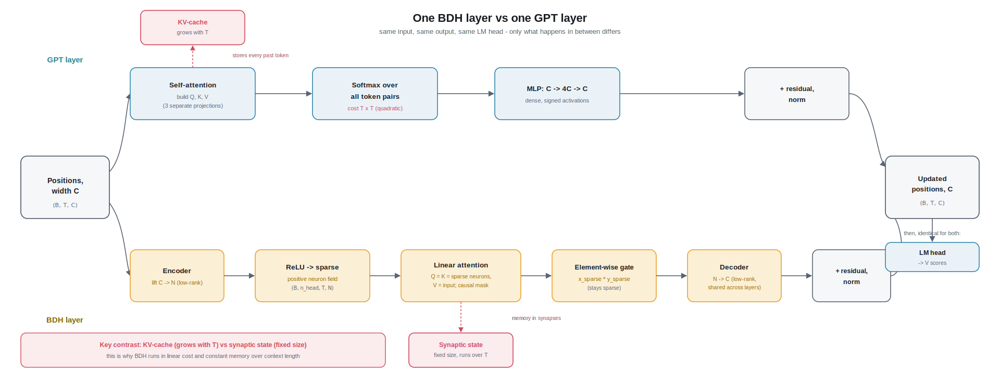

# Chapter 8 - BDH: The Twist

> Code for this chapter: `nanobdh/model_bdh.py` (the model), compared against
> `nanobdh/model_gpt.py` (the Transformer from Chapters 3 to 5). Both are trained by
> the same `nanobdh/train.py` on the same character stream from `data/prepare.py`.

## 1. The everyday picture

Imagine a big city at night. Every window is a tiny light bulb. Most bulbs are
**off**; only a few are on at any moment. When something interesting happens on one
street, a small cluster of nearby bulbs flick on together, and that pattern of lit
windows *is* the thought the city is having right now.

Now add one more thing: the roads **between** buildings. Every time two lit windows
"talk" to each other, the road between them gets a little more paved, a little
easier to travel next time. The city does not keep a diary of everything that
happened. Instead, its **memory lives in the roads**: which paths got worn in by use.

That is the Dragon Hatchling (BDH) in a nutshell:

- The **light bulbs** are neurons. Most are off (sparse), and the ones that are on
  are never negative (positive activity).
- The **roads** are synapses, the connections between neurons. Recent context is
  remembered by strengthening the right roads, not by storing a growing list of
  past words.
- **Attention** is not a special separate machine bolted on top. It is just what
  happens when lit neurons reinforce the roads between them and then travel those
  roads. It **emerges** from local, neuron-to-neuron interactions.

A Transformer (GPT), by contrast, is more like a meeting room where, at every step,
**every** person turns to **every** other person and explicitly asks "how relevant
are you to me?" and takes weighted notes. Powerful, but it is a very deliberate,
all-to-all comparison, and the notes (a buffer called the KV-cache, defined in
Section 2) pile up as the conversation grows.

Same job (predict the next character of Shakespeare), very different machine.

## 2. From zero: what BDH actually is

We will build up the vocabulary one word at a time. If you have read Chapters 2 to
5, you already know embeddings and attention; skim ahead. If not, start here.

### The starting point is identical to GPT

BDH and GPT begin the same way. A character like `'h'` is turned into an integer id
by the tokenizer (`nanobdh/tokenizer.py`), and that id is looked up in an
**embedding** table to become a vector of `C` numbers. `C` is the **embedding
dimension**, the "width" of the model's working representation. So a chunk of `T`
characters becomes a grid of numbers: `T` positions, each a vector of length `C`.

Everything after that is where the twist happens.

### Neuron: a single number that is either "quiet" or "firing"

A **neuron** here is just one number in a very long list. When that number is `0`
the neuron is **off** (quiet). When it is a positive value the neuron is **firing**,
and bigger means firing harder. Crucially it is **never negative**. In GPT, the
numbers inside a layer can be positive or negative and most of them are non-zero
(we call that **dense**). In BDH we deliberately force two properties:

- **Positive:** activity is `0` or above, never below. This comes from a function
  called **ReLU** (see below).
- **Sparse:** at any moment only a small fraction of neurons are firing (the paper
  and repo aim for roughly a few percent). Most are exactly `0`.

Why bother? Because "a small set of lit neurons" is easy for a human to read later.
If neuron 5142 lights up only when the text is inside a character's spoken line, you
can point at it and say what it *means*. That interpretability is a headline claim of
BDH and the subject of Chapter 9.

### ReLU: the "no negatives" rule

**ReLU** stands for Rectified Linear Unit, which is a fancy name for a dead-simple
rule: `relu(x) = max(0, x)`. Keep positive numbers as they are; replace every
negative number with `0`. That single rule is what makes BDH's neurons positive, and
because a lot of raw values come out negative, ReLU also zeroes many of them out,
which is where the **sparsity** comes from. In `nanobdh/model_bdh.py` you will see
`F.relu(...)` applied right after the model expands into its big neuron space.

### High neuron dimension: a small idea sent into a huge room

Here is the structural twist. GPT keeps thinking in the same modest width `C` the
whole time (with a temporary widen-and-shrink inside its MLP). BDH instead
**projects up** into a much larger space of neurons. Call that size `N`, the
**neuron dimension**, and it is many times bigger than `C` (in the reference repo
`N` is thousands while `C` is hundreds).

Think of `C` as a short summary and `N` as spreading that summary across a huge
board of light bulbs so that only a few, very specific bulbs light up. A big sparse
board can hold more distinct, cleanly separated concepts than a small dense one.

### ReLU-lowrank feed-forward: expand cheaply, then come back

"Feed-forward" is the part of a layer that transforms each position on its own
(no looking at neighbors). In GPT this is the MLP: widen from `C` to `4C`, apply a
nonlinearity, shrink back to `C`.

BDH does something similar in spirit but with two deliberate design choices baked
into the words **ReLU** and **low-rank**:

- **ReLU** is the nonlinearity, giving positive sparse neurons as above.
- **Low-rank** describes *how* the big neuron space is wired cheaply. A fully
  general interaction among `N` neurons would need a dense `N x N` weight matrix,
  and with `N` in the thousands that is a huge (`N x N`) parameter bill. BDH avoids
  it by routing everything through the small width `C`: an **encoder** lifts `C` up
  to `N`, and a **decoder** brings `N` back down to `C`. In `nanobdh/model_bdh.py`
  these are the parameters named `encoder` (shape `C x N` per head) and `decoder`
  (shape `N x C`). Because every neuron-space operation passes through that
  `C`-dimensional bottleneck, the effective `N x N` interaction it represents has
  rank at most `C`. That is exactly what "low-rank" means here, and it costs only
  about `2 x C x N` numbers instead of `N x N`. The same handful of these matrices
  is reused at every layer, which keeps the parameter count small.

So the feed-forward story is: **encode up to the big sparse positive neuron field,
do the mixing there, decode back down to width `C`.**

### Attention that emerges, and memory that lives in synapses

In GPT, attention is an explicit module: build Query, Key, Value vectors, compare
every token's Query to every token's Key with a softmax, and mix Values. It keeps a
**KV-cache**, a buffer that literally stores a Key and Value for every past token
and grows as the text gets longer.

BDH reframes this. Once positions are represented as sparse positive neuron
patterns, "paying attention to the past" becomes: **let the pattern of neurons
firing now pull in information from earlier positions whose neuron patterns overlap
with it.** Concretely BDH uses **linear attention**: rather than a softmax over all
pairs, the interaction can be accumulated as a running sum (a **state**) that each
new position updates and reads from. That running state is exactly the "roads
getting paved" from the intro. It is best understood as **memory stored in
synapses**: the strength of neuron-to-neuron connections, updated as you read,
rather than a lengthening list of past tokens.

The payoff of linear attention is cost. Classic softmax attention compares every
pair of positions, so work grows with `T x T`, and it must keep a per-token
KV-cache. Because linear attention has no softmax, the same computation can in
principle be rolled up into a fixed-size running state and run in roughly linear
time in `T`. That is central to BDH's efficiency claim. (Caveat: for simplicity both
the reference repo and `nanobdh/model_bdh.py` still compute the equivalent masked
`T x T` score matrix during training; the linear-time running-state form is the
mathematical property the paper leans on, not something this small teaching
implementation actually exploits.)

And this is why we say attention **emerges from local interactions**: there is no
separate "attention layer" with its own learned Q and K projections in the GPT
sense. The same sparse neuron activations that do the feed-forward also drive the
attention state. Attention falls out of neurons reinforcing and reading their own
connections over time.

### Putting one BDH layer together

One layer of BDH, in plain steps (each maps to code in `nanobdh/model_bdh.py`):

1. Take the current width-`C` representation of each position.
2. **Encode up** into the big neuron space `N` and apply **ReLU**. Now you have a
   sparse, positive pattern of firing neurons per position.
3. Let those firing neurons interact **over time** through the linear-attention
   mechanism (the synaptic memory). This is where earlier context flows in.
4. Combine the firing pattern with the freshly attended signal (an element-wise
   gate, so a neuron only contributes where it is currently firing).
5. **Decode down** from `N` back to width `C`.
6. Add the result back onto the input (a **residual** connection) and normalize.

Stack `n_layer` of these (BDH reuses the same shared weights at each one), then a
final linear **LM head** maps width `C` to `V` scores, one per possible next
character (`V` is about 65 for our vocabulary). From there it is identical to GPT:
softmax to probabilities, sample, append, repeat (Chapter 7).

## 3. Deeper dive

This section assumes you are comfortable with attention and the B/T/C/V notation.
Shapes below follow the reference implementation at github.com/pathwaycom/bdh, adapted
small for char-level TinyShakespeare in `nanobdh/model_bdh.py`.

### Notation and the extra dimension

Familiar sizes: `B` batch, `T` context length, `C` embedding dim, `V` vocab (~65),
`n_head` heads, `n_layer` layers. New size: `N`, the per-head neuron dimension. In
the repo `N = mlp_internal_dim_multiplier * C // n_head`, which for the defaults is
in the thousands. So `N` is roughly one to two orders of magnitude larger than the
per-head slice of `C`. The whole point is that `N` is big and its activations are
sparse.

### The parameters (and how few there are)

The reference `__init__` defines only a handful of weight tensors, and they are
**shared across all layers**:

- `encoder`: shape `(n_head, C, N)`. Lifts each position from `C` into `n_head`
  separate neuron subspaces of size `N`.
- `encoder_v`: shape `(n_head, C, N)`. A second lift used for the value/read path.
- `decoder`: shape `(n_head * N, C)`. Brings the big neuron space back down to `C`.
- `lm_head`: shape `(C, V)`. Final projection to per-character scores.

Contrast with GPT (`nanobdh/model_gpt.py`), which has **separate** query, key,
value, and projection matrices in every attention block plus a fat up/down MLP in
every block, all distinct per layer. BDH reuses one small set everywhere. That
weight sharing, plus routing the huge `N`-neuron interaction through the small width
`C` (the low-rank bottleneck), is why BDH can reach a large effective neuron count
`N` without the parameter blow-up. This is the concrete meaning of "low-rank
feed-forward".

### The forward pass, shape by shape

Sketch of the reference forward, annotated with shapes (matching the code in
`nanobdh/model_bdh.py`):

- Embed and add a head axis: `x` becomes `(B, 1, T, C)`, then layer-normalized.
- For each of `n_layer` levels:
  - `x_latent = x @ encoder` gives `(B, n_head, T, N)`.
  - `x_sparse = F.relu(x_latent)` is the **positive, sparse** neuron field,
    `(B, n_head, T, N)`. This is the "which bulbs are lit" per position.
  - Linear attention runs with `Q = x_sparse`, `K = x_sparse`, `V = x`. Note `Q`
    and `K` are the **same** sparse activations, not separate learned projections.
    Rotary position embeddings are applied, and causality is enforced by a lower
    triangular mask (`tril(diagonal=-1)`) so a position only reads strictly earlier
    ones. The output `yKV` is normalized.
  - `y_latent = yKV @ encoder_v`, then `y_sparse = F.relu(y_latent)`, another
    `(B, n_head, T, N)` sparse field for the read path.
  - `xy_sparse = x_sparse * y_sparse`: an **element-wise product**. This is the
    sparsity gate. A neuron contributes to the output only where it is firing in
    both the state and the read, which keeps activity sparse and localized.
  - `yMLP = xy_sparse.transpose(1, 2).reshape(B, 1, T, N*n_head) @ decoder` brings
    it back to `(B, 1, T, C)`. (The `transpose(1, 2)` moves the head axis next to
    `N` so the `n_head` neuron blocks concatenate correctly before the decoder.)
  - Residual and norm: `y = ln(yMLP)`, then `x = ln(x + y)` (two LayerNorms, both
    without learnable scale or bias).
- Finally `logits = x.view(B, T, C) @ lm_head` gives `(B, T, V)`, and
  `F.cross_entropy` against the shifted targets gives the training loss, exactly as
  in GPT.

Notice there is **no softmax over token pairs** and **no growing KV buffer** in the
attention step. The `Q @ K` interaction is masked and summed, and because `Q` and
`K` are the sparse neuron patterns themselves, that interaction can *in principle* be
carried as a fixed-size running state (the linear-attention efficiency argument),
even though this implementation materializes the masked `T x T` scores for
simplicity. That is the linear-attention, synaptic-memory mechanism made concrete.

### The WHY behind the choices

- **Why ReLU (positive activations)?** Positive-only activity plus a big space makes
  individual neurons interpretable. A neuron can stand for one concept and simply be
  off otherwise. Negatives and dense mixing (GPT) create **superposition**, where
  one number juggles many meanings at once and is hard to read.
- **Why sparse?** Sparsity is what lets a huge `N` be affordable and readable: most
  neurons are `0`, so the lit pattern is a short, meaningful code. It is also the
  brain-inspired part: real neurons fire rarely.
- **Why high dimension `N` with low-rank factoring?** You get the representational
  room of a giant neuron layer (`N` in the thousands) while paying only for the
  `C x N` encoder and `N x C` decoder that route through the narrow width `C` and are
  reused across layers. Room without the parameter bill.
- **Why linear attention / synaptic memory?** Softmax attention costs `T x T` and
  stores a per-token KV-cache. Because linear attention drops the softmax, the same
  math can be written as a fixed-size running state that costs roughly linear time in
  `T`, which is BDH's efficiency and "memory in synapses" story. It also makes
  "attention emerges from local interactions" literally true: no bespoke attention
  weights, just neurons reinforcing and reading their own connections.
- **Why keep the outer shell identical to GPT?** So the comparison is fair. Same
  tokenizer, same `data/prepare.py` stream, same `nanobdh/train.py` loop, same
  cross-entropy loss, same sampler in `nanobdh/sample.py`. Only the middle "thinking"
  block differs, which is exactly the variable we want to study.

### GPT vs BDH, concretely

| Aspect | GPT (`model_gpt.py`) | BDH (`model_bdh.py`) |
|---|---|---|
| Core mixing | explicit self-attention, softmax over all token pairs | linear attention (no softmax) emerging from sparse neurons |
| Working space | width `C` (MLP briefly `4C`), dense | width `C` lifted to huge sparse `N` per head |
| Activations | dense, positive and negative | ReLU, positive, sparse (few percent lit) |
| Q, K, V | three separate learned projections | `Q = K = ` sparse neurons, `V = ` the input |
| Context memory | KV-cache, grows with `T` | interaction expressible as a fixed-size synaptic state |
| Attention cost | scales with `T x T` | `T x T` as implemented; scales roughly with `T` in the recurrent form the math permits |
| Weights | separate Q/K/V/MLP per layer | one shared encoder/decoder set, low-rank through `C` |
| Interpretability | hard (superposition) | designed-in (monosemantic neurons/synapses) |
| Output tail | LM head to `V`, softmax, sample | identical |

That last row matters: from the LM head onward the two models are the same, which is
why they can share `train.py` and `sample.py` unchanged.

## 4. New terms

- **Neuron:** one number in BDH's big activation list; `0` means off, positive means
  firing.
- **ReLU:** `max(0, x)`; keeps positives, zeroes negatives. Source of positive,
  sparse activity.
- **Sparse activation:** at any moment only a few percent of neurons are non-zero.
- **Positive activation:** neuron values are never negative.
- **Neuron dimension `N`:** the large per-head space BDH expands into, much bigger
  than `C`.
- **Low-rank feed-forward:** expanding `C` to `N` and back through `C x N` encoder
  and `N x C` decoder matrices, so the effective `N x N` neuron interaction has rank
  at most `C` and costs about `2 x C x N` numbers instead of `N x N`.
- **Encoder / decoder (in BDH):** the shared matrices that lift to `N` and project
  back to `C`.
- **Linear attention:** attention with no softmax; because of that it can be written
  as a running state, cost roughly linear in `T`, with no growing KV-cache (though
  this teaching code still materializes the masked `T x T` scores).
- **Synapse / synaptic memory:** the connection strengths between neurons; BDH stores
  recent context here rather than in a token buffer.
- **Emergent attention:** attention that falls out of local neuron interactions
  rather than being a separate hand-built module.
- **Superposition:** GPT's tendency to pack many meanings into one dense number,
  which BDH avoids by design.

---

**Next:** Chapter 9 digs into BDH's interpretability claims (monosemantic neurons and
synapses) and runs the head-to-head comparison against GPT on TinyShakespeare.