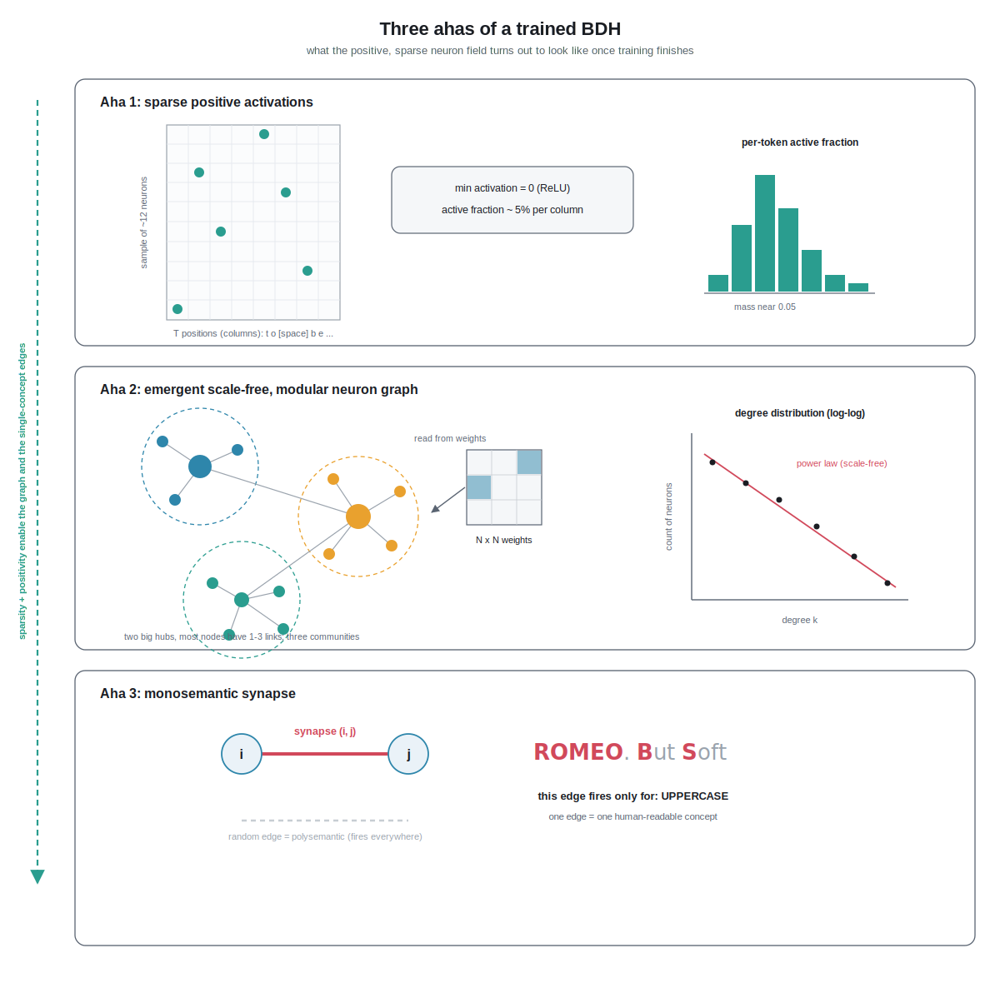

## Chapter 09 - The Ahas

### 1. Plain-English intro: reading a brain instead of a black box

Imagine you crack open two machines that both do the same job: writing Shakespeare one letter at a time.

The first machine (our Transformer, `nanobdh/model_gpt.py`) is like a wall of ten thousand light bulbs where, at every moment, almost all of them are glowing at some brightness, and most bulbs turn on for many unrelated reasons. If you point at one bulb and ask "what does this one mean?", the honest answer is "a little bit of everything." That is hard to interpret.

The second machine (BDH, the Dragon Hatchling, `nanobdh/model_bdh.py`) is built to behave more like a real brain. Most of its bulbs are dark at any instant. Only a small handful light up for any given letter. And the wires between the bulbs are not a random tangle: a few bulbs are giant hubs connected to everything, most bulbs have only a few connections, and the wiring falls into neat neighborhoods, exactly the lopsided, clustered pattern you see in biological brains and social networks. Best of all, you can sometimes find a single wire that lights up only when one specific idea shows up in the text, for example "we are inside a character's name" or "a newline is coming."

This chapter is about three payoffs you can actually reproduce and see with your own eyes after training BDH on character-level TinyShakespeare:

1. Sparse, positive activations (only about 5% of neurons active, and never negative).
2. An emergent scale-free, modular neuron graph that we read straight out of the trained weights.
3. Monosemantic synapses: individual connections that fire for exactly one concept.

We will define every term, then show how to measure and draw each one.

### 2. From zero: every term, then the three ahas

Let us build the vocabulary first, because these words are the whole game.

- A neuron here is just one number in a long list of numbers that the model computes while it reads a letter. "The neuron fired" means that number is large and positive. "The neuron is silent" means it is zero.
- An activation is the value of a neuron at a given moment. If you feed the model the text "To be", it produces one activation value per neuron for each position in that text.
- Positive activation means the number is never negative. It is either zero (silent) or a positive amount (firing). This is enforced by a function called ReLU, which is simply "keep the number if it is positive, otherwise replace it with zero." Real neurons also cannot fire "negatively," so this is deliberately brain-like.
- Sparse means most of them are zero at any instant. If only 5 out of every 100 neurons are firing, the activation is 5% sparse-active (95% silent).
- A synapse is the connection (a weight) between two neurons. In a brain it is the junction where one neuron passes a signal to another. In BDH it is a single number stored in a weight matrix saying "how strongly neuron i pushes on neuron j."
- A graph is just dots (neurons) joined by lines (synapses). "Reading a graph from the weights" means: treat the trained weight numbers as the lines, and study the shape of the resulting network.
- Scale-free describes a graph where a few dots are hugely connected (hubs) and most dots have very few connections. The number of connections follows a power law, meaning if you plot "how many neurons have exactly k connections" against k on a log-log chart, you get a straight downward line. Airports, the web, and brains are all scale-free.
- Modular means the graph splits into clusters or communities: groups of neurons that talk mostly to each other and rarely to outsiders, like friend groups.
- Monosemantic means "one meaning." A monosemantic synapse is a single connection that switches on for exactly one interpretable concept and stays quiet otherwise. The opposite is polysemantic (one thing meaning many things at once), which is what makes ordinary Transformers hard to read.
- Low-rank means a big projection that is actually built from a smaller "waist": instead of one fat matrix, you factor it through a much smaller number of directions (its rank), so lifting into a huge space stays cheap in parameters and compute.

Now the three ahas.

Aha 1: sparsity and positivity. When BDH reads a character, it lifts that character's small "meaning vector" into a much larger space of neurons and applies ReLU. Because ReLU zeroes out everything negative, and because training pushes the model to use only a few neurons per letter, you end up with a firing pattern where roughly 1 in 20 neurons is on. This is not an accident we hope for; it is a property we measure and expect to land near 5%. Notably, the paper does not force this sparsity during training - it emerges on its own. Sparse plus positive is what makes the next two ahas possible, because a signal carried by a few named, always-positive neurons is far easier to trace than a dense mix of pluses and minuses.

Aha 2: an emergent scale-free, modular neuron graph. Nobody tells BDH "please form hubs and communities." Yet after training on Shakespeare, if you look at the matrix of synapse strengths between neurons and draw it as a graph, it comes out scale-free and modular, matching the wiring statistics of biological brains. "Emergent" means it arises on its own from ordinary gradient descent, not from a rule we wrote. This is a headline claim of the Dragon Hatchling paper (Kosowski et al., 2025).

Aha 3: monosemantic synapses. Because activity is sparse and positive, we can watch individual synapses over lots of text and find ones that fire only for a single concept. On character-level Shakespeare a concept might be small and concrete: "inside a word of all capitals" (stage directions and names), "right after a period," or "the letter that follows q is almost always u." Finding even a few clean single-concept synapses is a big deal, because it means the model stored a human-readable fact in one identifiable place.

### 3. Deeper dive: mechanics, shapes, and how to measure each

Recall our notation from `nanobdh/__init__.py`: B = batch size, T = context length, C = embedding dim, V = vocab (about 65 for char-level TinyShakespeare). BDH adds one more dimension:

- N = the neuron dimension, the large "field of neurons." In BDH-GPU (`nanobdh/model_bdh.py`, adapted from github.com/pathwaycom/bdh) N is many times larger than C. Concretely, with this codebase's default C = 128, the neuron space is blown up by the `neuron_dim_multiplier` knob: nano-bdh defaults to 32x (kept small so it trains on a Mac), while the reference repo uses 128x. The core trick is a low-rank up-projection (an up-projection that factors through a smaller rank, so lifting into the huge N space stays cheap) from C into N followed by ReLU, giving positive sparse activity, then linear attention operating in the N-dimensional neuron space, then a projection back down to C. Layers share weights, which is part of why one clean neuron graph exists to study rather than a different one per layer.

The forward pass, in shapes, is roughly:

1. Token and position give a hidden state of shape (B, T, C).
2. An encoder maps C to N. After ReLU the neuron activations have shape (B, T, N) and are all >= 0. Call this tensor x. This x is the object of Aha 1.
3. Linear attention mixes information across the T positions using these positive neuron features (no softmax over all pairs; the mixing is linear). Context is accumulated in a state that behaves like synapses being written and read.
4. A decoder maps N back to C, and finally an LM head maps C to V logits per position, shape (B, T, V), the next-character scores.

Measuring Aha 1 (sparsity and positivity). Run the trained model over the validation split and grab the post-ReLU tensor x of shape (B, T, N) (expose it as a hook or return it in an interpretability path added to `nanobdh/model_bdh.py`).

- Positivity check: `x.min()` should be exactly 0.0. This is a sanity test that ReLU is doing its job.
- Sparsity metric: active fraction = mean over all (B, T, N) entries of (x > eps), with a small eps like 1e-6. Report the number; the target is roughly 0.05 (5%). You can also report the L0 count per token: how many of the N neurons are nonzero for each position, averaged over B*T tokens.
- Why measure per token, not globally: sparsity is a property of one letter's firing pattern, so averaging the per-token active count is the honest statistic.
- Visualize: a histogram of per-token active fraction (most mass near 5%), and a heatmap of x for a single short sentence with the T positions on one axis and a sample of N neurons on the other, so you literally see a mostly-dark grid with a few bright dots per column.

Measuring Aha 2 (scale-free, modular graph). The neuron-to-neuron coupling lives in the trained weight matrices of `nanobdh/model_bdh.py`. Because BDH uses low-rank factors, the effective synapse matrix between the N neurons is the product of the encoder and decoder factors (an N by N object, but you never need to materialize all of it densely if N is large). Build the graph like this:

- Form the weight magnitude between neuron i and neuron j, then keep only the strongest edges (threshold, or keep the top-k per neuron) so you get a sparse adjacency for N nodes.
- Degree distribution: for each neuron count its surviving edges (its degree k). Plot the count of neurons with degree k against k on log-log axes. Scale-free shows up as a straight descending line; you can fit a power-law exponent (for real-world scale-free networks this is commonly between 2 and 3, though the BDH paper only reports that in- and out-degree follow power laws with different exponents) with a library like `powerlaw` and compare against a shuffled-weight control that should not be straight.
- Modularity: run a community-detection algorithm (Louvain via `networkx` or `python-louvain`) and report the modularity score Q; higher and clearly above a random-graph baseline means real communities.
- Why this is meaningful: gradient descent on next-character loss had no term rewarding hubs or clusters, so their appearance is emergent structure, the paper's central interpretability claim.
- Visualize: a force-directed layout (spring layout) of the thresholded graph, nodes colored by their detected community, hubs drawn larger. Beside it, the log-log degree plot with the fitted line.

Measuring Aha 3 (monosemantic synapses). A synapse's activity at a given token is the co-firing of its two endpoint neurons, roughly the product x_i * x_j (both are positive, so the product is a clean nonnegative "this connection is active" signal), gated by the learned weight of that edge. Procedure:

- Choose a set of candidate concepts you can label from the raw text without the model: "character is uppercase," "character is a newline," "previous character was a space (word start)," "inside a run of the same letter," and so on. Each concept gives a 0/1 label per token over the validation stream.
- For each strong edge (i, j), collect its activity over all B*T tokens and measure how selectively it lines up with one concept. A simple, defensible metric is the point-biserial correlation or the mutual information between the edge-active signal and the concept label; an even simpler screen is: of the times this edge is strongly active, what fraction of tokens carry concept c? An edge that is active almost only when c is present, and c is present almost whenever it is active, is monosemantic for c.
- Rank edges by selectivity and inspect the top ones. Contrast with a random edge, which will smear across many concepts (polysemantic) and score low.
- Why sparsity is the enabler: if 95% of neurons were firing at once, almost every edge would be active almost always, so no edge could be selective. Positivity plus sparsity is exactly what buys you findable single-concept connections.
- Visualize: take the most monosemantic edge and print a passage of TinyShakespeare with each character highlighted by that edge's activity. You should see the highlight land on, and only on, the concept (for example, every uppercase letter lights up and nothing else does).

Where the code goes. The measurements read tensors and weights from `nanobdh/model_bdh.py`; you train the checkpoint with `nanobdh/train.py --model bdh`; and you can reuse the generation path in `nanobdh/sample.py` to feed the model the exact text you want to probe. Keep the analysis in a small script (for example under `reports/`) so the model file stays clean and the graphs regenerate from a saved checkpoint.

A grounding caution: these are properties to reproduce and honestly report, not guarantees. On a tiny char-level model the numbers may land near but not exactly at 5%, the power-law fit may be noisy, and only a few synapses may be cleanly monosemantic. That is fine and expected; the point of the chapter is that BDH makes these questions answerable at all, which is exactly what the Transformer baseline in `nanobdh/model_gpt.py` does not.

### 4. New terms

- Neuron (in BDH): one entry in the large N-dimensional activation vector; "fires" when its value is large and positive.
- Activation: the value a neuron takes while the model reads a given position.
- ReLU: "keep positives, zero out negatives"; forces activations to be non-negative.
- Sparse activation: most neurons are zero at any moment; we target about 5% active.
- Positive activation: activations are never negative, mimicking real neurons.
- Synapse: the weight (connection strength) between two neurons.
- Neuron graph: dots (neurons) joined by lines (synapses), read directly from trained weights.
- Scale-free: a graph with a few huge hubs and many low-degree nodes; degree follows a power law (straight line on log-log).
- Power law: a distribution where "many small, few huge" holds; the signature of scale-free structure.
- Low-rank: a big projection built from a smaller "waist" (its rank), so it stays cheap in parameters and compute.
- Modular / community: clusters of neurons that connect mostly among themselves.
- Modularity (Q): a score for how cleanly a graph splits into communities.
- Monosemantic: fires for exactly one concept. Polysemantic is the messy opposite.
- N (neuron dimension): BDH's large activation space, much bigger than C.
- Emergent: structure that appears on its own from training, not from a hand-written rule.