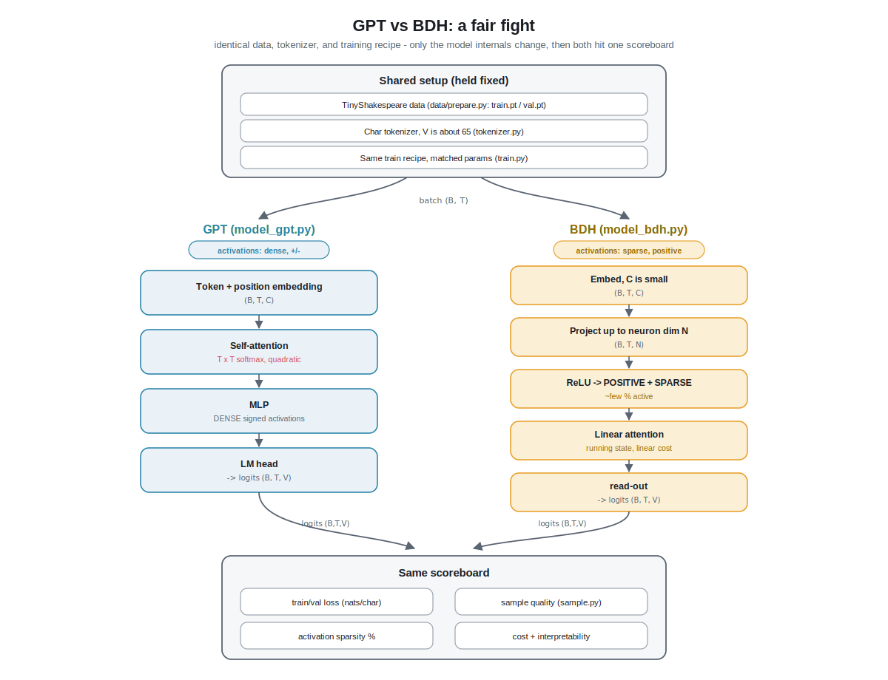

# Chapter 10 - GPT vs BDH: The Comparison

## 1. The everyday picture (no jargon yet)

Imagine two students who both have to sit the same exam. To make the contest
fair, you give them the same textbook, the same amount of study time, and you
even make sure they carry the same number of "brain cells" (so one is not simply
bigger than the other). Then you grade them on the exact same questions.

That is what this chapter does with our two models. One student is the
**Transformer (GPT)**, the mainstream design that powers ChatGPT and friends.
The other is **BDH**, the brain-inspired "Dragon Hatchling". We already built
both on the same textbook (TinyShakespeare, one character at a time). Now we sit
them down for a fair, head-to-head exam and grade them on four things:

1. How well they learn the training text.
2. How well they handle text they have never seen (the honesty check).
3. What their writing actually looks like.
4. How they think internally, and how much of their "brain" lights up at once.

The point is not to crown a winner. At this tiny scale, on a laptop, neither
becomes Shakespeare. The point is to see, concretely, **what each design is good
at and where it struggles**, so the words "attention" and "sparse neurons" from
earlier chapters turn into something you can measure.

## 2. From zero: what a "fair comparison" even means

Before we compare two things, we have to make everything else equal. Otherwise
we are not measuring the *design*, we are measuring who got the bigger advantage.
Here is every knob we hold fixed, with the plain meaning of each.

**Same data.** Both models read the exact same file: TinyShakespeare, about one
megabyte of the playwright's lines glued together. It is prepared once by
`data/prepare.py`, which downloads the text and saves it as `train.pt` (the 90%
they study from) and `val.pt` (the 10% held back for the honesty check).

**Same tokenizer.** A **tokenizer** is just a two-way dictionary that turns text
into numbers, because a neural network only does math, not reading. We use the
**character-level** one in `nanobdh/tokenizer.py`: every distinct character
(letter, space, punctuation, newline) is one number. TinyShakespeare has about 65
of them, so our **vocabulary** (the full set of things the model can predict) has
about 65 entries. Both students use the identical dictionary, so token number 12
means the same character to both.

**Matched size.** Each model is a big pile of adjustable numbers called
**parameters** (or weights). "Learning" is nothing more than slowly setting those
numbers to good values. If one model had ten times more parameters, of course it
would probably do better, but that would tell us nothing about the *design*. So
we deliberately size BDH in `nanobdh/model_bdh.py` and GPT in
`nanobdh/model_gpt.py` to land at roughly the same parameter count. That is the
"same number of brain cells" rule from the analogy.

**Same training recipe.** Both are trained by the one shared loop in
`nanobdh/train.py`, launched with `--model gpt` or `--model bdh`. Same optimizer
(the thing that does the nudging, called AdamW), same number of steps, same
context length, same way of measuring wrongness. Only the model swaps out.

Now the four things we measure.

**Training loss and validation loss.** **Loss** is a single number that says how
wrong the model's guesses are; lower is better. **Training loss** is measured on
text the model studies, **validation loss** on the held-out text it never trains
on. Why keep both? Because a model can cheat by *memorizing* the study text.
Memorizing pushes training loss down but does nothing for the unseen text, so if
training loss keeps dropping while validation loss stalls or rises, the model is
**overfitting** (memorizing instead of learning the real patterns of English and
Shakespeare). The gap between the two numbers is the tell.

**Sample quality.** Numbers only go so far, so we also just read what each model
writes. We ask both to generate a page of "Shakespeare" using `nanobdh/sample.py`
and eyeball it. At the character level the ladder of skill looks like: random
gibberish, then real words, then plausible line breaks and speaker names like
`ROMEO:`, then something that *sounds* Shakespearean even if it means nothing.

**Activation sparsity.** When a model processes a character, a bunch of internal
numbers "light up". **Activation** just means the current value flowing through a
neuron; if it is near zero, that neuron is effectively silent. **Sparsity** means
*most* neurons are silent at any moment and only a few are active, exactly like
your brain, where only a small fraction of neurons fire for any given thought.
This is the headline difference: GPT's insides are **dense** (most numbers are
nonzero, and they can be positive or negative), while BDH is deliberately built so
its neuron layer is **sparse and positive** (only a small percentage are nonzero,
and none go negative). We can literally count what fraction is nonzero and compare.

**What each is good at (at this scale).** Spoiler, grounded below: GPT usually
reaches a slightly lower loss slightly faster and is rock-solid to train, because
its machinery is mature and battle-tested. BDH's appeal is not a lower loss on a
toy task; it is that its sparse, positive insides are far easier to *interpret*
(you can point at a neuron and often say what it means), and its design comes with
theoretical claims about scaling and brain-like structure. On a laptop with one
megabyte of text, you should expect the two to land in the **same ballpark** on
loss and sample quality, with GPT modestly ahead on raw numbers and BDH ahead on
"can I understand what it is doing inside".

**Honest limitations at this scale.** One megabyte is tiny. Neither model has
enough data or size to write coherent sentences with real meaning; both top out
at "looks like Shakespeare if you squint". Any loss difference of a few hundredths
is within noise, so do not over-read a single run. And BDH's biggest selling
points (graceful scaling, interpretability that stays clean as the model grows)
are claims about *large* models; our toy cannot prove or disprove them. What our
toy *can* honestly show you is: both designs learn, both generate Shakespeare-ish
text, and their internals look measurably different.

## 3. Deeper dive: the real mechanics and shapes

Recall our notation: **B** = batch size (how many text windows we process at
once), **T** = block/context length (how many characters the model sees before
predicting the next), **C** = embedding dimension (the width of each token's
meaning-vector), **V** = vocabulary size (about 65 here), plus **n_head** and
**n_layer** (BDH reuses both of these knobs too, not just the Transformer).

### Setting up the fair fight

Both models consume the identical batch tensor of token ids with shape
`(B, T)` produced by `get_batch` in `nanobdh/train.py`, and both are asked to
produce logits of shape `(B, T, V)`: for every one of the B*T positions, a raw
score for each of the V possible next characters. The shared training loop
flattens those to `(B*T, V)` and compares against the true next characters with
**cross-entropy** loss. Because the interface (`(B, T)` in, `(B, T, V)` out) is
identical, `train.py` and `sample.py` do not care which model is plugged in; that
is what makes the comparison mechanically fair.

**Parameter matching.** GPT's parameters live mostly in three places: the token
embedding table `(V, C)`, the attention and MLP weights inside each of `n_layer`
blocks (which scale roughly as `n_layer * C^2`), and the final language-model head
`(C, V)`. BDH's parameters live in its low-rank projections between the embedding
width `C` and a much larger internal **neuron dimension** `N` (think `N` in the
thousands while `C` stays small), plus its own read-out. To match totals we tune
`C`, `n_layer`, and `N` so both report a similar count (the models print their
parameter count on init). A typical toy setting is a few hundred thousand to a
couple million parameters. The rule of thumb: do not compare two models unless
their parameter printouts agree to within, say, ten percent.

### GPT internals, in shapes

In `nanobdh/model_gpt.py`, each block does self-attention then an MLP. Attention
forms queries, keys, and values of shape `(B, n_head, T, C/n_head)`, computes a
`(B, n_head, T, T)` score matrix (every position against every earlier position),
softmaxes it into weights, and mixes the values. The **why**: this lets any
position pull information directly from any earlier position in one hop, which is
why Transformers are so good at long-range structure. The cost: that `T x T`
matrix is **quadratic** in context length, and the activations are dense, most of
the `(B, T, C)` numbers are nonzero and can be negative. During generation, our
nanoGPT-style `sample.py` does not keep a KV-cache: at each step it simply re-runs
the model on the last T characters (the context is cropped to the block size),
recomputing attention from scratch. A KV-cache (a buffer of past keys and values
that grows with the text) is the standard production optimization that avoids that
recomputation, but we skip it here to keep the code simple.

### BDH internals, in shapes

`nanobdh/model_bdh.py` (adapted small and heavily commented from the real
`pathwaycom/bdh` code) works differently. It projects each token from the narrow
width `C` up into the wide neuron dimension `N`, applies a **ReLU** so every
neuron value is clamped to be positive or zero (`ReLU(x) = max(0, x)`), which is
what forces the layer to be **positive and sparse**, then mixes information across
positions with **linear attention** rather than the softmax `T x T` matrix.

Linear attention is the key mechanical trick, and the "linear" refers to *no
softmax over the scores*. Mathematically, linear attention can be computed as a
running summary (a **state**) that is updated as you walk left to right through the
T positions, and it is that recurrent form which lets the cost grow *linearly*
with context length instead of quadratically. It also means context is remembered
in an accumulating state (BDH frames this as information stored in **synapses**,
the connection strengths between neurons) rather than as a KV buffer. That
linear-time form is BDH's theoretical selling point. Our small `model_bdh.py`,
however, computes the same result the simple way for a laptop: it forms a masked
`(B, n_head, T, T)` score matrix (`Q @ K^T` with a strictly-lower-triangular mask,
so each position sees only strictly-earlier ones, and crucially no softmax), so at
this toy scale the compute is still quadratic in T even though the design permits a
linear-time implementation. High neuron count `N` plus sparsity is the whole bet: a
big field of neurons where only a few fire, so each active neuron can come to stand
for one interpretable thing (the paper's ideal is "monosemantic" units).

### Reading the four metrics like an engineer

**Loss curves.** Plot training and validation loss versus step for both. Expect
both curves to plunge from about `ln(V)` (roughly 4.17 for `V=65`, the loss of
pure guessing) down toward the region of 1.4 to 1.6 nats per character on this
dataset for well-tuned tiny models. GPT typically gets there a hair faster and
lower. Watch the **train-minus-val gap**: on one megabyte with a couple million
parameters, a widening gap late in training is overfitting, and it can bite either
model. If BDH's val loss is within a few hundredths of GPT's, call it a tie; the
run-to-run noise is that large.

**Sample quality.** Generate with matched settings in `sample.py` (same
temperature, same top-k, same seed if you want reproducibility). Judge by the
ladder: correct spelling of common words, sane whitespace and newlines,
`NAME:` speaker tags, balanced-ish punctuation. Both should clear "real words and
line structure"; neither will clear "actually means something". Do not let one
model's cherry-picked lucky sample fool you; read several.

**Activation sparsity.** For BDH, hook the neuron layer and measure the fraction
of the `(B, T, N)` activations that are nonzero after the ReLU; the design target
is a small percentage active (single digits). For GPT, measure the fraction of
nonzero activations in the MLP hidden layer; even with its GELU nonlinearity (a
smooth ReLU-like curve that rarely outputs exactly zero) it is far denser, and its
residual-stream values are signed. The concrete, teachable result: same task, same
loss ballpark, but wildly different internal occupancy. That sparsity is exactly
what buys BDH its interpretability story.

**The honest verdict at this scale.** GPT is the safer, faster-to-a-good-loss
baseline and the one you must understand first, because everything else is
measured against it. BDH matches it closely enough on a toy to be a real
contender, while being in principle cheaper in context-length scaling (linear, not
quadratic, by design) and dramatically more interpretable inside. But one megabyte
of Shakespeare cannot settle the interesting questions; it can only show you, with
your own eyes and a few counters, that two very different machines both learned to
fake Shakespeare, and that they did it in visibly different ways.

## 4. New terms

- **Fair comparison / controlled experiment:** holding data, tokenizer, size, and
  training recipe fixed so any difference is due to the model design alone.
- **Parameter matching:** deliberately sizing two models to the same parameter
  count so neither wins just by being bigger.
- **Training loss vs validation loss:** wrongness on studied text vs on held-out
  text; the gap reveals memorizing.
- **Overfitting:** memorizing the training text instead of learning general
  patterns, seen as training loss dropping while validation loss does not.
- **Activation:** the current value flowing through a neuron; near zero means
  silent.
- **Activation sparsity:** most neurons silent at any moment, only a few active.
- **Dense (activations):** the opposite; most values nonzero, and possibly signed.
- **Neuron dimension (N):** BDH's large internal width where the sparse, positive
  neuron field lives.
- **Linear attention:** mixing context without a softmax; mathematically it can be
  run as a running state whose cost grows linearly with sequence length, though our
  toy computes the same result via a masked `T x T` matrix for simplicity.
- **ReLU:** the function `max(0, x)` that clamps values to be positive or zero,
  the source of BDH's positivity and sparsity.
- **Synapse (BDH sense):** a connection strength between neurons where BDH stores
  context, its alternative to a KV-cache.
- **Nats per character:** the unit of our cross-entropy loss; pure guessing on a
  V=65 vocab is about ln(65) = 4.17.